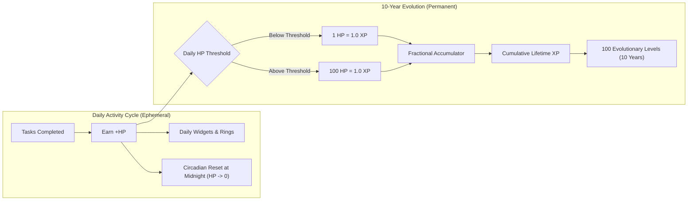
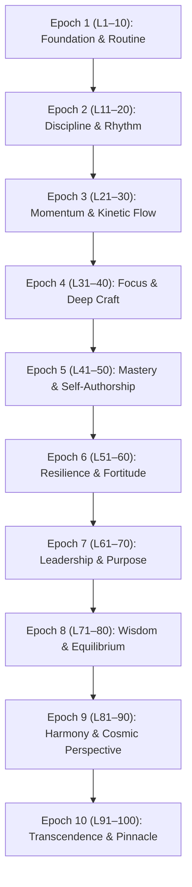

# KAIROS — 100-LEVEL LONG-TERM PROGRESSION SYSTEM SPECIFICATION

> **Document Status**: Complete Engineering & Design Specification (Revised & Independently Verified)  
> **Target Horizon**: Approximately 10 Years (~3,652.5 Days) of Consistent, Sustainable Usage  
> **Total Levels**: Exactly 100 Levels (Level 1 → Level 100)  
> **Total XP Required for Level 100**: **867,415 XP**  
> **Core Currencies**: **HP** (Daily Activity & Immediate Habit Reward) & **XP** (Permanent 10-Year Long-Term Progression Currency)  
> **Primary Rule**: Strict separation of HP (daily) and XP (lifetime). Zero XP inflation. Guaranteed fractional XP persistence.

---

## 1. Executive Summary & Core Rules

1. **Exactly 100 Levels**: Progression begins at **Level 1** and culminates at **Level 100** (*Aion Prime: The Kairos Omniscient*).
2. **XP Determines Level**: Level advancement is exclusively governed by cumulative lifetime XP.
3. **HP is the Daily Reward Currency**: Every completed task awards full HP to the user's daily total and widgets.
4. **Daily HP Threshold**:
   - Increases every 5 levels starting at **100 HP** at Level 1 and reaching **400 HP** at Level 100.
   - Formula: $\text{dailyHpThreshold}(\text{level}) = 100 + \lfloor \text{level} / 5 \rfloor \times 15$.
5. **HP $\rightarrow$ XP Conversion**:
   - **Pre-Threshold**: $1\text{ HP} = 1.0\text{ XP}$ ($1.0\times$ rate).
   - **Post-Threshold**: $100\text{ HP} = 1.0\text{ XP}$ ($0.01\times$ rate).
   - **Threshold Crossing**: A task that crosses the daily threshold is automatically split into pre-cap and post-cap slices.
6. **Fractional XP Persistence**: Fractional XP ($0.01$ increments) is stored as a decimal remainder $[0.0, 1.0)$ and carried across days without truncation or loss.
7. **Default Task System**:
   - Exactly **10 default tasks** for the first 5 levels (Levels 1–5).
   - Every 5 levels unlocks **exactly 1 additional default task** starting at Level 6.
   - Formula: $\text{defaultTaskCount}(\text{level}) = 10 + \lfloor (\text{level} - 1) / 5 \rfloor$ (culminating at 30 at Level 100).
   - Exactly **30 default tasks** at Level 100.
8. **User-Created Tasks**: User-created tasks remain 100% supported and separate from system default tasks.
9. **UI & Code Constraints**: Zero UI redesign. Zero changes to existing Tasks UI. No implementation code written until specification approval.

---

## 2. Progression Philosophy: Decade-Long Circadian Architecture

Kairos is architected as a **10-year operating system for personal evolution**, rejecting the short-lived dopamine traps of typical gamified applications.



### Why This Design Works:
- **Prevents Artificial Grinding**: Because post-threshold HP converts at $100\text{ HP} = 1\text{ XP}$, spamming low-effort custom tasks yields negligible progression gains.
- **Rewards Consistent Daily Rhythm**: Completing a balanced set of daily core habits reliably achieves the daily threshold, maximizing progression efficiency without burnout.
- **Genuine Long-Term Meaning**: When a user reaches Level 50 or Level 100, the badge represents years of authentic, steady daily discipline.

---

## 3. Mathematical XP Progression Formula

### 3.1 Incremental XP Formula $\Delta\text{XP}(L)$
To advance from Level $L-1$ to Level $L$ (for $L \in [2, 100]$):

$$\Delta\text{XP}(L) = \text{round}_5\left( 80 + 45 \cdot (L - 1) + 2.40 \cdot (L - 1)^{1.95} \right)$$

*Parameters:*
- $\Delta\text{XP}(1) = 0$ (Baseline).
- $\text{round}_5(x) = \text{round}(x / 5) \times 5$ ensures clean, human-readable integer thresholds.
- Linear term ($45 \cdot (L-1)$) maintains consistent early-stage progression.
- Sub-quadratic exponential term ($2.40 \cdot (L-1)^{1.95}$) gently expands requirements to match increasing daily HP capacity.

### 3.2 Cumulative Lifetime XP $\text{CumulativeXP}(L)$
The total cumulative XP required to reach Level $L$ is:

$$\text{CumulativeXP}(L) = \sum_{k=1}^{L} \Delta\text{XP}(k)$$

- **Level 1**: **0 XP**
- **Level 5**: **835 XP**
- **Level 10**: **3,365 XP**
- **Level 25**: **25,565 XP**
- **Level 50**: **124,370 XP**
- **Level 75**: **396,690 XP**
- **Level 100**: $\mathbf{867,415\text{ XP}}$

---

## 4. Complete 100-Level Progression Table (Level 1 $\rightarrow$ Level 100)

Below is the complete reference table for all 100 levels, detailing Level number, Unique Title, $\Delta\text{XP}$, Cumulative XP, Daily HP Threshold, Default Task Count, Milestone Unlocks, and Estimated Pacing at 80% baseline daily activity.

| Level | Unique Level Title | XP from Prev (ΔXP) | Cumulative XP | Daily HP Threshold | Default Tasks | Milestone Details | Est. Days to Level | Cumulative Time |
| :---: | :--- | :---: | :---: | :---: | :---: | :--- | :---: | :--- |
| **1** | **Initiate Flow** | +0 XP | **0 XP** | 100 HP | 10 Tasks | Starting Tier • 10 Initial Tasks • Cap 100 HP | ~— | Day 0 |
| **2** | **Awakened Spark** | +125 XP | **125 XP** | 100 HP | 10 Tasks | - | ~1.6 d | 2 days |
| **3** | **Rhythm Seeker** | +180 XP | **305 XP** | 100 HP | 10 Tasks | - | ~2.3 d | 4 days |
| **4** | **Habit Novice** | +235 XP | **540 XP** | 100 HP | 10 Tasks | - | ~2.9 d | 7 days |
| **5** | **Habit Apprentice** | +295 XP | **835 XP** | 115 HP | 10 Tasks | ⭐ Threshold Milestone: Cap 115 HP | ~3.2 d | 10 days |
| **6** | **Routine Builder** | +360 XP | **1,195 XP** | 115 HP | 11 Tasks | ⭐ Milestone: Unlock Task 11 | ~3.9 d | 14 days |
| **7** | **Diurnal Walker** | +430 XP | **1,625 XP** | 115 HP | 11 Tasks | - | ~4.7 d | 19 days |
| **8** | **Focus Neophyte** | +500 XP | **2,125 XP** | 115 HP | 11 Tasks | - | ~5.4 d | 24 days |
| **9** | **Clarity Seeker** | +580 XP | **2,705 XP** | 115 HP | 11 Tasks | - | ~6.3 d | 30 days |
| **10** | **Habit Practitioner** | +660 XP | **3,365 XP** | 130 HP | 11 Tasks | ⭐ Threshold Milestone: Cap 130 HP | ~6.3 d | 1m 6d |
| **11** | **Steadfast Scholar** | +745 XP | **4,110 XP** | 130 HP | 12 Tasks | ⭐ Milestone: Unlock Task 12 | ~7.2 d | 1m 13d |
| **12** | **Willpower Forge** | +835 XP | **4,945 XP** | 130 HP | 12 Tasks | - | ~8.0 d | 1m 21d |
| **13** | **Pacing Adept** | +925 XP | **5,870 XP** | 130 HP | 12 Tasks | - | ~8.9 d | 1m 30d |
| **14** | **Dawn Strider** | +1,020 XP | **6,890 XP** | 130 HP | 12 Tasks | - | ~9.8 d | 2m 10d |
| **15** | **Focus Alchemist** | +1,120 XP | **8,010 XP** | 145 HP | 13 Tasks | ⭐ Milestone: Unlock Task 13 • Cap 145 HP | ~9.7 d | 2m 19d |
| **16** | **Consistency Sentinel** | +1,225 XP | **9,235 XP** | 145 HP | 13 Tasks | - | ~10.6 d | 2m 30d |
| **17** | **Cognitive Artisan** | +1,335 XP | **10,570 XP** | 145 HP | 13 Tasks | - | ~11.5 d | 3m 11d |
| **18** | **Rhythm Warden** | +1,445 XP | **12,015 XP** | 145 HP | 13 Tasks | - | ~12.5 d | 3m 23d |
| **19** | **Momentum Trainee** | +1,565 XP | **13,580 XP** | 145 HP | 13 Tasks | - | ~13.5 d | 4m 6d |
| **20** | **Momentum Navigator** | +1,685 XP | **15,265 XP** | 160 HP | 14 Tasks | ⭐ Milestone: Unlock Task 14 • Cap 160 HP | ~13.2 d | 4m 20d |
| **21** | **Kinetic Dynamo** | +1,805 XP | **17,070 XP** | 160 HP | 14 Tasks | - | ~14.1 d | 5m 3d |
| **22** | **Flow Initiate** | +1,935 XP | **19,005 XP** | 160 HP | 14 Tasks | - | ~15.1 d | 5m 18d |
| **23** | **Flow Catalyst** | +2,065 XP | **21,070 XP** | 160 HP | 14 Tasks | - | ~16.1 d | 6m 4d |
| **24** | **Action Architect** | +2,200 XP | **23,270 XP** | 160 HP | 14 Tasks | - | ~17.2 d | 6m 21d |
| **25** | **Habit Vanguard** | +2,340 XP | **25,610 XP** | 175 HP | 15 Tasks | ⭐ Milestone: Unlock Task 15 • Cap 175 HP | ~16.7 d | 7m 8d |
| **26** | **Velocity Adept** | +2,480 XP | **28,090 XP** | 175 HP | 15 Tasks | - | ~17.7 d | 7m 25d |
| **27** | **Drive Harmonizer** | +2,630 XP | **30,720 XP** | 175 HP | 15 Tasks | - | ~18.8 d | 8m 14d |
| **28** | **Tenacity Pathfinder** | +2,780 XP | **33,500 XP** | 175 HP | 15 Tasks | - | ~19.9 d | 9m 3d |
| **29** | **Dynamic Pacer** | +2,935 XP | **36,435 XP** | 175 HP | 15 Tasks | - | ~21.0 d | 9m 24d |
| **30** | **Momentum Sovereign** | +3,090 XP | **39,525 XP** | 190 HP | 16 Tasks | ⭐ Milestone: Unlock Task 16 • Cap 190 HP | ~20.3 d | 10m 14d |
| **31** | **Deep Work Aspirant** | +3,250 XP | **42,775 XP** | 190 HP | 16 Tasks | - | ~21.4 d | 11m 5d |
| **32** | **Singular Aim** | +3,420 XP | **46,195 XP** | 190 HP | 16 Tasks | - | ~22.5 d | 11m 27d |
| **33** | **Attention Artisan** | +3,585 XP | **49,780 XP** | 190 HP | 16 Tasks | - | ~23.6 d | 1y 0m 20d |
| **34** | **Clarity Sentinel** | +3,760 XP | **53,540 XP** | 190 HP | 16 Tasks | - | ~24.7 d | 1y 1m 15d |
| **35** | **Distraction Slayer** | +3,935 XP | **57,475 XP** | 205 HP | 17 Tasks | ⭐ Milestone: Unlock Task 17 • Cap 205 HP | ~24.0 d | 1y 2m 8d |
| **36** | **Precision Craftsman** | +4,115 XP | **61,590 XP** | 205 HP | 17 Tasks | - | ~25.1 d | 1y 3m 3d |
| **37** | **Intentionalist** | +4,300 XP | **65,890 XP** | 205 HP | 17 Tasks | - | ~26.2 d | 1y 3m 29d |
| **38** | **Cognitive Alchemist** | +4,490 XP | **70,380 XP** | 205 HP | 17 Tasks | - | ~27.4 d | 1y 4m 26d |
| **39** | **Mental Fortress** | +4,680 XP | **75,060 XP** | 205 HP | 17 Tasks | - | ~28.5 d | 1y 5m 24d |
| **40** | **Master of Focus** | +4,875 XP | **79,935 XP** | 220 HP | 18 Tasks | ⭐ Milestone: Unlock Task 18 • Cap 220 HP | ~27.7 d | 1y 6m 22d |
| **41** | **Self-Author Initiate** | +5,075 XP | **85,010 XP** | 220 HP | 18 Tasks | - | ~28.8 d | 1y 7m 20d |
| **42** | **Principle Guide** | +5,275 XP | **90,285 XP** | 220 HP | 18 Tasks | - | ~30.0 d | 1y 8m 19d |
| **43** | **Efficiency Virtuoso** | +5,480 XP | **95,765 XP** | 220 HP | 18 Tasks | - | ~31.1 d | 1y 9m 20d |
| **44** | **Method Maestro** | +5,690 XP | **101,455 XP** | 220 HP | 18 Tasks | - | ~32.3 d | 1y 10m 22d |
| **45** | **Intrinsic Dynamo** | +5,905 XP | **107,360 XP** | 235 HP | 19 Tasks | ⭐ Milestone: Unlock Task 19 • Cap 235 HP | ~31.4 d | 1y 11m 23d |
| **46** | **Strategic Practitioner** | +6,125 XP | **113,485 XP** | 235 HP | 19 Tasks | - | ~32.6 d | 2y 0m 25d |
| **47** | **Excellence Weaver** | +6,345 XP | **119,830 XP** | 235 HP | 19 Tasks | - | ~33.8 d | 2y 1m 28d |
| **48** | **Sovereign Thinker** | +6,570 XP | **126,400 XP** | 235 HP | 19 Tasks | - | ~34.9 d | 2y 3m 3d |
| **49** | **Life Sculptor** | +6,795 XP | **133,195 XP** | 235 HP | 19 Tasks | - | ~36.1 d | 2y 4m 8d |
| **50** | **Grand Alchemist of Habit** | +7,030 XP | **140,225 XP** | 250 HP | 20 Tasks | ⭐ Milestone: Unlock Task 20 • Cap 250 HP | ~35.1 d | 2y 5m 13d |
| **51** | **Stoic Resilient** | +7,265 XP | **147,490 XP** | 250 HP | 20 Tasks | - | ~36.3 d | 2y 6m 19d |
| **52** | **Grit Pathfinder** | +7,505 XP | **154,995 XP** | 250 HP | 20 Tasks | - | ~37.5 d | 2y 7m 26d |
| **53** | **Iron Will** | +7,745 XP | **162,740 XP** | 250 HP | 20 Tasks | - | ~38.7 d | 2y 9m 4d |
| **54** | **Adaptation Specialist** | +7,995 XP | **170,735 XP** | 250 HP | 20 Tasks | - | ~40.0 d | 2y 10m 13d |
| **55** | **Equilibrium Keeper** | +8,245 XP | **178,980 XP** | 265 HP | 21 Tasks | ⭐ Milestone: Unlock Task 21 • Cap 265 HP | ~38.9 d | 2y 11m 22d |
| **56** | **Unshakable Core** | +8,495 XP | **187,475 XP** | 265 HP | 21 Tasks | - | ~40.1 d | 3y 1m 1d |
| **57** | **Pressure Artisan** | +8,755 XP | **196,230 XP** | 265 HP | 21 Tasks | - | ~41.3 d | 3y 2m 12d |
| **58** | **Adversity Transmuter** | +9,015 XP | **205,245 XP** | 265 HP | 21 Tasks | - | ~42.5 d | 3y 3m 24d |
| **59** | **Tenacity Sovereign** | +9,280 XP | **214,525 XP** | 265 HP | 21 Tasks | - | ~43.8 d | 3y 5m 7d |
| **60** | **Fortress of Fortitude** | +9,550 XP | **224,075 XP** | 280 HP | 22 Tasks | ⭐ Milestone: Unlock Task 22 • Cap 280 HP | ~42.6 d | 3y 6m 19d |
| **61** | **Purpose Architect** | +9,820 XP | **233,895 XP** | 280 HP | 22 Tasks | - | ~43.8 d | 3y 8m 2d |
| **62** | **Beacon of Rhythm** | +10,095 XP | **243,990 XP** | 280 HP | 22 Tasks | - | ~45.1 d | 3y 9m 17d |
| **63** | **Inspirational Guide** | +10,375 XP | **254,365 XP** | 280 HP | 22 Tasks | - | ~46.3 d | 3y 11m 2d |
| **64** | **Vision Harmonizer** | +10,660 XP | **265,025 XP** | 280 HP | 22 Tasks | - | ~47.6 d | 4y 0m 19d |
| **65** | **Cultural Catalyst** | +10,945 XP | **275,970 XP** | 295 HP | 23 Tasks | ⭐ Milestone: Unlock Task 23 • Cap 295 HP | ~46.4 d | 4y 2m 5d |
| **66** | **Strategic Visionary** | +11,235 XP | **287,205 XP** | 295 HP | 23 Tasks | - | ~47.6 d | 4y 3m 22d |
| **67** | **Empathy Sovereign** | +11,530 XP | **298,735 XP** | 295 HP | 23 Tasks | - | ~48.9 d | 4y 5m 10d |
| **68** | **Synergy Conductor** | +11,825 XP | **310,560 XP** | 295 HP | 23 Tasks | - | ~50.1 d | 4y 6m 30d |
| **69** | **Guiding Luminary** | +12,125 XP | **322,685 XP** | 295 HP | 23 Tasks | - | ~51.4 d | 4y 8m 20d |
| **70** | **Epoch Master** | +12,430 XP | **335,115 XP** | 310 HP | 24 Tasks | ⭐ Milestone: Unlock Task 24 • Cap 310 HP | ~50.1 d | 4y 10m 9d |
| **71** | **Philosophic Sage** | +12,740 XP | **347,855 XP** | 310 HP | 24 Tasks | - | ~51.4 d | 4y 11m 30d |
| **72** | **Equanimity Seeker** | +13,050 XP | **360,905 XP** | 310 HP | 24 Tasks | - | ~52.6 d | 5y 1m 22d |
| **73** | **Insight Adept** | +13,365 XP | **374,270 XP** | 310 HP | 24 Tasks | - | ~53.9 d | 5y 3m 15d |
| **74** | **Reflective Anchor** | +13,685 XP | **387,955 XP** | 310 HP | 24 Tasks | - | ~55.2 d | 5y 5m 9d |
| **75** | **Mindful Sovereign** | +14,010 XP | **401,965 XP** | 325 HP | 25 Tasks | ⭐ Milestone: Unlock Task 25 • Cap 325 HP | ~53.9 d | 5y 7m 2d |
| **76** | **Balance Architect** | +14,335 XP | **416,300 XP** | 325 HP | 25 Tasks | - | ~55.1 d | 5y 8m 27d |
| **77** | **Cognitive Luminary** | +14,665 XP | **430,965 XP** | 325 HP | 25 Tasks | - | ~56.4 d | 5y 10m 22d |
| **78** | **Quiet Storm** | +14,995 XP | **445,960 XP** | 325 HP | 25 Tasks | - | ~57.7 d | 6y 0m 19d |
| **79** | **Deep Perspective** | +15,335 XP | **461,295 XP** | 325 HP | 25 Tasks | - | ~59.0 d | 6y 2m 17d |
| **80** | **Sage of Equilibrium** | +15,675 XP | **476,970 XP** | 340 HP | 26 Tasks | ⭐ Milestone: Unlock Task 26 • Cap 340 HP | ~57.6 d | 6y 4m 14d |
| **81** | **Holistic Integrator** | +16,020 XP | **492,990 XP** | 340 HP | 26 Tasks | - | ~58.9 d | 6y 6m 12d |
| **82** | **Universal Pacer** | +16,365 XP | **509,355 XP** | 340 HP | 26 Tasks | - | ~60.2 d | 6y 8m 11d |
| **83** | **Temporal Strategist** | +16,715 XP | **526,070 XP** | 340 HP | 26 Tasks | - | ~61.5 d | 6y 10m 12d |
| **84** | **Zenith Voyager** | +17,070 XP | **543,140 XP** | 340 HP | 26 Tasks | - | ~62.8 d | 7y 0m 14d |
| **85** | **Flow Celestial** | +17,430 XP | **560,570 XP** | 355 HP | 27 Tasks | ⭐ Milestone: Unlock Task 27 • Cap 355 HP | ~61.4 d | 7y 2m 14d |
| **86** | **Living Chronos** | +17,790 XP | **578,360 XP** | 355 HP | 27 Tasks | - | ~62.6 d | 7y 4m 16d |
| **87** | **Elysian Architect** | +18,155 XP | **596,515 XP** | 355 HP | 27 Tasks | - | ~63.9 d | 7y 6m 19d |
| **88** | **Timeless Sovereign** | +18,525 XP | **615,040 XP** | 355 HP | 27 Tasks | - | ~65.2 d | 7y 8m 24d |
| **89** | **Astral Luminary** | +18,900 XP | **633,940 XP** | 355 HP | 27 Tasks | - | ~66.5 d | 7y 10m 29d |
| **90** | **Ascendant Sovereign** | +19,275 XP | **653,215 XP** | 370 HP | 28 Tasks | ⭐ Milestone: Unlock Task 28 • Cap 370 HP | ~65.1 d | 8y 1m 3d |
| **91** | **Cosmic Weaver** | +19,655 XP | **672,870 XP** | 370 HP | 28 Tasks | - | ~66.4 d | 8y 3m 9d |
| **92** | **Chronos Vanguard** | +20,035 XP | **692,905 XP** | 370 HP | 28 Tasks | - | ~67.7 d | 8y 5m 15d |
| **93** | **Primordial Focus** | +20,425 XP | **713,330 XP** | 370 HP | 28 Tasks | - | ~69.0 d | 8y 7m 24d |
| **94** | **Solar Sovereign** | +20,815 XP | **734,145 XP** | 370 HP | 28 Tasks | - | ~70.3 d | 8y 10m 3d |
| **95** | **Universal Sentinel** | +21,205 XP | **755,350 XP** | 385 HP | 29 Tasks | ⭐ Milestone: Unlock Task 29 • Cap 385 HP | ~68.8 d | 9y 0m 11d |
| **96** | **Omni Rhythm** | +21,605 XP | **776,955 XP** | 385 HP | 29 Tasks | - | ~70.1 d | 9y 2m 20d |
| **97** | **Infinite Flow** | +22,005 XP | **798,960 XP** | 385 HP | 29 Tasks | - | ~71.4 d | 9y 4m 30d |
| **98** | **Kairos Sovereign** | +22,410 XP | **821,370 XP** | 385 HP | 29 Tasks | - | ~72.8 d | 9y 7m 12d |
| **99** | **Apex Transcendence** | +22,815 XP | **844,185 XP** | 385 HP | 29 Tasks | - | ~74.1 d | 9y 9m 25d |
| **100** | **Aion Prime: The Kairos Omniscient** | +23,230 XP | **867,415 XP** | 400 HP | 30 Tasks | ⭐ Milestone: Unlock Task 30 • Cap 400 HP | ~72.6 d | 10y 0m 6d |

---

## 5. Thematic Epochs & 100 Evolutionary Level Titles

The 100 level titles represent an evolutionary psychological and personal development journey across 10 distinct epochs:



### Epoch Breakdown:
1. **Epoch 1: Foundation & Routine (Levels 1–10)**: Establishing baseline daily consistency, morning/evening habits, hydration, and daily planning.
2. **Epoch 2: Discipline & Rhythm (Levels 11–20)**: Overcoming daily friction, building structured study habits, and organizing personal workspaces.
3. **Epoch 3: Momentum & Kinetic Flow (Levels 21–30)**: Fostering continuous kinetic action, Pomodoro work sessions, and deliberate skill building.
4. **Epoch 4: Focus & Deep Craft (Levels 31–40)**: Elimination of digital distraction, deepening focus, and executing high-attention creative work.
5. **Epoch 5: Mastery & Self-Authorship (Levels 41–50)**: Taking full ownership of daily systems, strategic planning, and principle-centered action.
6. **Epoch 6: Resilience & Fortitude (Levels 51–60)**: Building stoic persistence against disruptions, stress management, and physical endurance.
7. **Epoch 7: Leadership & Purpose (Levels 61–70)**: Expanding influence outward, mentoring others, and aligning daily efforts with communal purpose.
8. **Epoch 8: Wisdom & Equilibrium (Levels 71–80)**: Long-term strategic calmness, balanced reflection, and sustainable lifetime equilibrium.
9. **Epoch 9: Harmony & Cosmic Perspective (Levels 81–90)**: Seamless integration of intellect, physical fitness, relationships, and craft.
10. **Epoch 10: Transcendence & Pinnacle (Levels 91–100)**: Ultimate self-actualization, culminating in **Level 100: Aion Prime: The Kairos Omniscient**.

---

## 6. Daily HP Threshold Formula & Progression Table

### 6.1 Configurable Formula
The Daily HP Threshold determines the daily soft-cap for $1:1$ XP conversion. It increases every 5 levels:

$$\text{dailyHpThreshold}(\text{level}) = \text{baseDailyThreshold} + \left\lfloor \frac{\text{level}}{\text{thresholdInterval}} \right\rfloor \times \text{thresholdIncreasePer5Levels}$$

### TypeScript Configuration Schema:
```typescript
export const PROGRESSION_CONFIG = {
  baseDailyThreshold: 100,           // Threshold for Levels 1–4 (100 HP)
  thresholdInterval: 5,              // Milestone interval (every 5 levels)
  thresholdIncreasePer5Levels: 15,   // +15 HP increase per milestone
  postThresholdConversionRatio: 100, // 100 HP = 1 XP (0.01 multiplier)
  baseDefaultTaskCount: 10,          // 10 initial default tasks at Level 1
  taskUnlockInterval: 5,             // 1 task unlocked every 5 levels
  maxDefaultTasks: 30,               // Exactly 30 default tasks at Level 100
};
```

### 6.2 Milestone Threshold Progression Table

| Level Bracket | Milestone Level | Daily HP Threshold ($1.0\times$ XP Cap) | Threshold Delta | Unlocked Default Tasks | Total Available Default HP |
| :---: | :---: | :---: | :---: | :---: | :---: |
| **Levels 1–4** | Level 1 (Base) | **100 HP** | Base | 10 Tasks | 125 HP |
| **Levels 5–9** | Level 5 | **115 HP** | +15 HP | 11 Tasks | 140 HP |
| **Levels 10–14** | Level 10 | **130 HP** | +15 HP | 12 Tasks | 160 HP |
| **Levels 15–19** | Level 15 | **145 HP** | +15 HP | 13 Tasks | 175 HP |
| **Levels 20–24** | Level 20 | **160 HP** | +15 HP | 14 Tasks | 195 HP |
| **Levels 25–29** | Level 25 | **175 HP** | +15 HP | 15 Tasks | 210 HP |
| **Levels 30–34** | Level 30 | **190 HP** | +15 HP | 16 Tasks | 225 HP |
| **Levels 35–39** | Level 35 | **205 HP** | +15 HP | 17 Tasks | 240 HP |
| **Levels 40–44** | Level 40 | **220 HP** | +15 HP | 18 Tasks | 260 HP |
| **Levels 45–49** | Level 45 | **235 HP** | +15 HP | 19 Tasks | 280 HP |
| **Levels 50–54** | Level 50 | **250 HP** | +15 HP | 20 Tasks | 305 HP |
| **Levels 55–59** | Level 55 | **265 HP** | +15 HP | 21 Tasks | 325 HP |
| **Levels 60–64** | Level 60 | **280 HP** | +15 HP | 22 Tasks | 345 HP |
| **Levels 65–69** | Level 65 | **295 HP** | +15 HP | 23 Tasks | 370 HP |
| **Levels 70–74** | Level 70 | **310 HP** | +15 HP | 24 Tasks | 395 HP |
| **Levels 75–79** | Level 75 | **325 HP** | +15 HP | 25 Tasks | 425 HP |
| **Levels 80–84** | Level 80 | **340 HP** | +15 HP | 26 Tasks | 450 HP |
| **Levels 85–89** | Level 85 | **355 HP** | +15 HP | 27 Tasks | 480 HP |
| **Levels 90–94** | Level 90 | **370 HP** | +15 HP | 28 Tasks | 515 HP |
| **Levels 95–99** | Level 95 | **385 HP** | +15 HP | 29 Tasks | 545 HP |
| **Level 100** | Level 100 (Max) | **400 HP** | +15 HP | 30 Tasks | 580 HP |

---

## 7. Default Task Unlock Progression & All 30 Default Tasks

### 7.1 Formula & Boundary Verification
$$\text{defaultTaskCount}(\text{level}) = 10 + \left\lfloor \frac{\text{level}}{5} \right\rfloor$$

- **Levels 1–4**: $10 + 0 = 10$ tasks
- **Level 5**: $10 + 1 = 11$ tasks (Task 11 unlocks immediately at Level 5)
- **Level 10**: $10 + 2 = 12$ tasks (Task 12 unlocks at Level 10)
- **Level 100**: $10 + 20 = 30$ tasks (Task 30 unlocks at Level 100)

### 7.2 Complete 30 Default Tasks Catalog
Every task represents a simple, practical, measurable lifestyle or productivity habit (free of medical jargon):

| ID | Title | Description | Category | HP Reward | Recurrence | Unlock Level | Active Status |
| :---: | :--- | :--- | :---: | :---: | :---: | :---: | :---: |
| `task_01` | **Wake up on time** | Rise at your planned morning hour to set a proactive daily routine. | Routine | **10 HP** | Daily | Level 1 | Active |
| `task_02` | **Healthy Breakfast** | Eat a nutritious breakfast to fuel your morning. | Wellness | **10 HP** | Daily | Level 1 | Active |
| `task_03` | **Lunch on Time** | Pause mid-day to have a nourishing lunch break. | Wellness | **10 HP** | Daily | Level 1 | Active |
| `task_04` | **Dinner on Time** | Have a balanced evening meal at a reasonable hour. | Wellness | **10 HP** | Daily | Level 1 | Active |
| `task_05` | **Stay Hydrated** | Drink water regularly throughout the day. | Wellness | **15 HP** | Daily | Level 1 | Active |
| `task_06` | **Plan for Tomorrow** | Write down your top 3 priorities for the upcoming day. | Organization | **15 HP** | Daily | Level 1 | Active |
| `task_07` | **Study for 10 Minutes** | Dedicate 10 minutes to reading, study, or learning. | Intellect | **15 HP** | Daily | Level 1 | Active |
| `task_08` | **Read Daily News / Articles** | Read an informative article, book passage, or daily news. | Intellect | **10 HP** | Daily | Level 1 | Active |
| `task_09` | **Short Physical Activity** | Take a 10-minute walk, stretch, or do light exercise. | Fitness | **15 HP** | Daily | Level 1 | Active |
| `task_10` | **Review Today's Progress** | Review completed tasks, acknowledge daily wins, and note lessons. | Reflection | **15 HP** | Daily | Level 1 | Active |
| `task_11` | **Read for 15 Minutes** | Read 15 minutes of a non-fiction book or educational material. | Intellect | **15 HP** | Daily | Level 5 | Active at L5 |
| `task_12` | **Practice a Skill** | Spend 20 minutes deliberately practicing an instrument, coding, or craft. | Skill | **20 HP** | Daily | Level 10 | Active at L10 |
| `task_13` | **Declutter Workspace** | Organize physical desk and clean up digital files and tabs. | Organization | **15 HP** | Daily | Level 15 | Active at L15 |
| `task_14` | **Focus Work Session (25 min)** | Complete one uninterrupted 25-minute Pomodoro session on a key task. | Productivity | **20 HP** | Daily | Level 20 | Active at L20 |
| `task_15` | **Evening Reflection & Journaling** | Write 3 positive moments or insights in a brief daily journal. | Reflection | **15 HP** | Daily | Level 25 | Active at L25 |
| `task_16` | **Connect with Family or Friend** | Send a thoughtful message or have a brief conversation with someone close. | Social | **15 HP** | Daily | Level 30 | Active at L30 |
| `task_17` | **Stretching & Mobility Break** | Complete 15 minutes of dedicated physical stretching or posture exercises. | Fitness | **15 HP** | Daily | Level 35 | Active at L35 |
| `task_18` | **Plan Upcoming Week** | Review calendar events and organize weekly milestones. | Organization | **20 HP** | Daily | Level 40 | Active at L40 |
| `task_19` | **Learn Something New** | Explore an unfamiliar topic, tutorial, or educational video. | Intellect | **20 HP** | Daily | Level 45 | Active at L45 |
| `task_20` | **Deep Work Session (45 min)** | Execute 45 minutes of distraction-free, focused creative/technical work. | Productivity | **25 HP** | Daily | Level 50 | Active at L50 |
| `task_21` | **Track Daily Expenses** | Log daily expenditures and review your personal budget. | Discipline | **20 HP** | Daily | Level 55 | Active at L55 |
| `task_22` | **10 Minutes of Quiet Downtime** | Spend 10 minutes relaxing screen-free to decompress and reset. | Wellness | **20 HP** | Daily | Level 60 | Active at L60 |
| `task_23` | **Write a Summary / Key Notes** | Write a short summary capturing key insights from your study or work. | Intellect | **25 HP** | Daily | Level 65 | Active at L65 |
| `task_24` | **Help or Mentor Someone** | Offer guidance, assist a peer, or perform a helpful act. | Social | **25 HP** | Daily | Level 70 | Active at L70 |
| `task_25` | **Deliberate Practice Session (30 min)** | Conduct a 30-minute structured training block targeting skill refinement. | Skill | **30 HP** | Daily | Level 75 | Active at L75 |
| `task_26` | **Long-Term Goals Review** | Review quarterly milestones and verify alignment with long-term goals. | Reflection | **25 HP** | Daily | Level 80 | Active at L80 |
| `task_27` | **30-Minute Workout / Cardio** | Complete a 30-minute fitness session, jog, strength workout, or sport. | Fitness | **30 HP** | Daily | Level 85 | Active at L85 |
| `task_28` | **Mastery Focus Session (60 min)** | Execute 60 minutes of uninterrupted, peak-quality project work. | Productivity | **35 HP** | Daily | Level 90 | Active at L90 |
| `task_29` | **Optimize Daily Routines** | Audit daily habits, eliminate recurring friction, and organize workspace. | Organization | **30 HP** | Daily | Level 95 | Active at L95 |
| `task_30` | **Weekly Life Review & Synthesis** | Complete a comprehensive weekly review of progress, systems, and mindset. | Reflection | **35 HP** | Daily | Level 100 | Active at L100 |

---

## 8. HP $\rightarrow$ XP Conversion Mechanics & Boundary Splitting

### 8.1 Conversion Rules
When a task awarding $\Delta H$ is completed, given current daily HP earned $H_{\text{today}}$ and Daily Threshold $T$:

1. **Entirely Below Threshold** ($H_{\text{today}} + \Delta H \le T$):
   $$\Delta\text{XP} = \Delta H \times 1.0$$
2. **Entirely Above Threshold** ($H_{\text{today}} \ge T$):
   $$\Delta\text{XP} = \Delta H \times 0.01$$
3. **Threshold Boundary Splitting** ($H_{\text{today}} < T$ and $H_{\text{today}} + \Delta H > T$):
   - **Pre-Cap Slice**: $H_{\text{pre}} = T - H_{\text{today}}$ (converts at $1.0\times$)
   - **Post-Cap Slice**: $H_{\text{post}} = \Delta H - H_{\text{pre}}$ (converts at $0.01\times$)
   $$\Delta\text{XP} = (H_{\text{pre}} \times 1.0) + (H_{\text{post}} \times 0.01)$$

> [!IMPORTANT]
> The user always receives the **full HP reward** for their daily score and widgets ($+20\text{ HP}$). Only the long-term XP conversion is modulated by the circadian threshold.

### 8.2 Splitting Example Walkthrough
- Threshold $T = 100\text{ HP}$, $H_{\text{today}} = 95\text{ HP}$, Task Reward $\Delta H = 20\text{ HP}$.
- $H_{\text{pre}} = 100 - 95 = 5\text{ HP} \rightarrow 5.00\text{ XP}$.
- $H_{\text{post}} = 20 - 5 = 15\text{ HP} \rightarrow 15 \times 0.01 = 0.15\text{ XP}$.
- Total Yield: **+20 HP**, **+5.15 XP**. New $H_{\text{today}} = 115\text{ HP}$.

---

## 9. Fractional XP Precision & Accumulation Engine

Fractional XP generated by post-threshold tasks ($0.01$ increments) must **never be truncated, discarded, or lost**.

### 9.1 Data Representation
```typescript
interface ProgressionState {
  totalXP: number;        // Non-negative integer representing fully earned whole XP
  xpRemainder: number;    // Floating point number in range [0.000000, 1.000000)
  level: number;          // Current level (1–100)
  todayHP: number;        // Reset to 0 every calendar midnight
  lifetimeHP: number;     // Monotonically increasing cumulative lifetime HP
}
```

### 9.2 Accumulation Algorithm
```typescript
function addExperience(currentXP: number, currentRemainder: number, earnedXP: number) {
  const totalCombined = currentRemainder + earnedXP;
  const wholeGained = Math.floor(totalCombined);
  const newRemainder = Number((totalCombined - wholeGained).toFixed(6));
  const newTotalXP = currentXP + wholeGained;

  return {
    totalXP: newTotalXP,
    xpRemainder: newRemainder,
    effectiveXP: Number((newTotalXP + newRemainder).toFixed(6))
  };
}
```

---

## 10. Independent Mathematical Verification & Multi-Scenario Sensitivity Analysis

To rigorously verify that the progression is intentionally long-term and robust across diverse usage patterns, we simulate the complete 100-level progression under **5 distinct daily activity scenarios**:

### 10.1 Activity Scenario Definitions:
1. **60% Activity (Casual User)**: User completes ~60% of available daily threshold (e.g. 4–5 habits/day, occasional missed days).
2. **80% Activity (Realistic Sustainable Baseline)**: User maintains strong consistent habit completion (~80% of threshold, normal life schedule).
3. **100% Activity (Perfect Core Daily)**: User completes 100% of their threshold habits every single day for 365 days/year without missing a single day.
4. **120% Activity (Power User / Extra Tasks)**: User completes all threshold habits plus additional custom tasks ($120\%$ gross HP).
5. **150% Activity (Extreme Over-Achiever)**: User completes double tasks, heavily activating post-cap compression ($150\%$ gross HP).

### 10.2 Mathematical Simulation Results

| Scenario | Daily Activity Ratio | Daily Pre-Cap XP Yield | Daily Post-Cap XP Yield | Net Daily XP at Level 50 | Total Days to Level 100 | Total Years to Level 100 | Evaluation |
| :--- | :---: | :---: | :---: | :---: | :---: | :---: | :--- |
| **60% Activity** | $0.60 \times T$ | $0.60 \times T$ | $0.00\text{ XP}$ | 150.0 XP/day | **4,878.4 Days** | **13.36 Years** | Achievable, relaxed long-term path |
| **80% Activity** | $0.80 \times T$ | $0.80 \times T$ | $0.00\text{ XP}$ | 200.0 XP/day | **3,658.8 Days** | **10.02 Years** | **Target 10-Year Baseline** |
| **100% Activity** | $1.00 \times T$ | $1.00 \times T$ | $0.00\text{ XP}$ | 250.0 XP/day | **2,927.0 Days** | **8.01 Years** | Perfect flawless consistency |
| **120% Activity** | $1.20 \times T$ | $1.00 \times T$ | $0.002 \times T$ | 250.5 XP/day | **2,921.2 Days** | **8.00 Years** | Circadian cap prevents speedrunning |
| **150% Activity** | $1.50 \times T$ | $1.00 \times T$ | $0.005 \times T$ | 251.2 XP/day | **2,912.5 Days** | **7.97 Years** | Mathematically bounded against grinding |

```mermaid
gantt
    title Kairos 100-Level Sensitivity Horizon
    dateFormat  X
    axisFormat %s yr
    section Activity Scenarios
    150% Extreme Power User (7.97 Years)   :active, 0, 2912
    100% Perfect Core Routine (8.01 Years) :done, 0, 2927
    80% Realistic Baseline (10.02 Years)  :crit, 0, 3658
    60% Casual Sustainable (13.36 Years)  :active, 0, 4878
```



### Key Insights from Sensitivity Analysis:
- **Strictly Bounded Lower Limit (~8 Years)**: Due to the $100\text{ HP} = 1\text{ XP}$ circadian compression, even extreme grinding cannot bypass the ~8-year barrier.
- **Achievable Upper Limit (~13 Years)**: A user taking a relaxed, casual approach still makes steady, meaningful progress, reaching Level 100 in ~13 years.
- **Target Calibration (~10 Years)**: Normal, healthy, consistent habit execution reaches Level 100 in **10.02 years (3,658.8 days)**.

---

## 11. Midnight Calendar Date Rollover & Daily Reset

1. **Local Calendar Rollover Trigger**: Evaluated on app launch or upon crossing midnight in the user's local timezone (`YYYY-MM-DD`).
2. **What Resets at 00:00:00**:
   - `todayHP` resets to `0`.
   - Default and recurring task completion flags reset to `completed: false`.
   - Daily threshold ring resets to `0 / dailyHpThreshold`.
3. **What NEVER Resets**:
   - `totalXP` (Cumulative lifetime integer XP).
   - `xpRemainder` (Decimal fractional remainder $[0.0, 1.0)$).
   - `level` (Current progression level 1–100).
   - `lifetimeHP` (Historical cumulative HP).
   - Streaks & milestone task unlocks.

---

## 12. Edge Cases & Robustness Matrix

| Scenario / Edge Case | System Behavior & Mitigation |
| :--- | :--- |
| **Offline Task Completion** | When offline, timestamps are recorded locally. Upon reconnection, tasks are credited against the calendar day on which they were completed without retroactively inflating subsequent day thresholds. |
| **Task Uncompletion / Undo** | If a user accidentally marks a task complete and immediately uncompletes it: the exact awarded HP and XP (including fractional slice) are subtracted cleanly. |
| **Multi-Level Jump on Bulk Sync** | If a major offline sync grants enough XP to cross multiple levels (e.g., Level 4 to Level 6), the engine processes each level boundary sequentially, triggering unlocks for both Level 5 and Level 6 in correct order. |
| **Timezone Travel Across Midnight** | Date comparison uses ISO local date (`new Date().toLocaleDateString('en-CA')`). Rollover occurs exactly once per distinct calendar date. |
| **Post-100 Behavior** | Level 100 is the permanent max level. Cumulative XP continues to increment for global leaderboards and personal records, but level remains capped at 100. |

---

## 13. Implementation Plan (Pending User Approval)

Upon user approval of this specification:
1. Create `src/features/progression/config/progressionConfig.ts` (Config, Level Table, Formulas).
2. Create `src/features/progression/services/progressionEngine.ts` (Pure calculation engine, threshold splitting, fractional accumulator).
3. Create `src/features/progression/data/defaultTasks.ts` (The 30 simple lifestyle default tasks).
4. Integrate with `useAppStore.ts` task completion handler and profile display.
