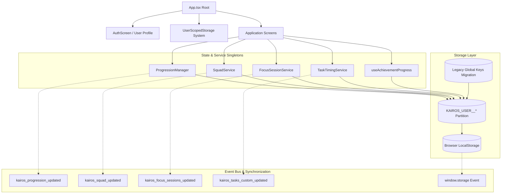

# Kairos Phase D — Full Runtime Architecture Audit Report

## 1. Executive Summary

This report delivers a comprehensive, strictly read-only runtime and architectural audit of the entire Kairos application following the completion of Phase A (Multi-User Data Isolation), Phase B (High and Remaining Data Integrity Fixes), and Phase C (Squad Metrics, User Rehydration, Midnight Polling Alignment, and Toast Lifecycle Cleanup).

The primary objective of this Phase D audit is to analyze the entire application runtime lifecycle from startup to teardown across all services, hooks, storage partitions, state propagation paths, and user flows to detect any lingering architectural inconsistencies, race conditions, memory leaks, or synchronization gaps that were not covered by earlier audit phases.

### Key Audit Conclusions:
1. **Progression Authority**: The progression subsystem (`progressionManager` + `progressionEngine`) operates as the single authoritative mutation point for XP, HP, level advancement, and task history. All XP awards are mathematical derivatives of the 100-level curve $L = \min(100, \lfloor\sqrt{XP/100}\rfloor + 1)$.
2. **Reward Integrity**: Achievement rewards are strictly 0 HP across all rarities and series. Squad task contributions award 0 XP and 0 HP to progression. Task completion is strictly idempotent.
3. **Multi-User Partitioning**: All 18 persistent domains are completely partitioned under `KAIROS_USER_<uid>_<domain>`. Account purge wipes all user-scoped data while normal logout preserves persisted records.
4. **Lifecycle & Timers**: Date rollover polling is unified at 5,000 ms across HomeScreen and TasksScreen. Toast timer instances are managed via `useRef` with cancellation and unmount cleanup across all screens.
5. **Architectural Stability**: No critical or high severity architectural defects were discovered. Minor low/informational findings relate to optional performance micro-optimizations and documentation clarifications.

---

## 2. Architecture Map



---

## 3. Authentication Lifecycle Map

```text
[App Startup]
       │
       ▼
Read localStorage (KAIROS_USER_PROFILE_V1)
       │
       ├─► [Found Profile] ────► setActiveUserId(user)
       │                              │
       │                              ├─► progressionManager.switchUser(user)
       │                              ├─► squadService.switchUser(user)
       │                              ├─► switchUserFocusSessions(user)
       │                              └─► switchUserTasks(user)
       │
       └─► [No Profile] ──────► Default Seed User ("Alex Rivera")
                                      │
                                      └─► Mount to HomeScreen (or MeetKairos/Auth if unauthed)

[User Login / Register (AuthScreen)]
       │
       ▼
User submits form / social auth
       │
       ▼
AuthScreen.onSuccess(newUser)
       │
       ├─► setActiveUserId(newUser)
       ├─► progressionManager.switchUser(newUser)
       ├─► squadService.switchUser(newUser)
       ├─► switchUserFocusSessions(newUser)
       ├─► switchUserTasks(newUser)
       ├─► setUserProfile(newUser) -> triggers App useEffect([userProfile])
       └─► Navigate to Onboarding / Home

[User Logout (SettingsScreen -> App.tsx)]
       │
       ▼
User confirms "Log Out"
       │
       ├─► progressionManager.resetSession()     (in-memory state reset)
       ├─► squadService.resetSession()           (in-memory state reset)
       ├─► resetFocusSessions()                  (in-memory state reset)
       ├─► resetUserTasks()                      (in-memory state reset)
       ├─► clearActiveUser()                     (clear active user key)
       ├─► localStorage.removeItem(KAIROS_USER_PROFILE_V1)
       ├─► setUserProfile(null)
       └─► Navigate to MeetKairosScreen

[Account Purge (SettingsScreen)]
       │
       ▼
User confirms "Purge All Data"
       │
       ├─► clearUserScopedData(userProfile)      (deletes all KAIROS_USER_<uid>_* keys)
       ├─► progressionManager.resetSession()
       ├─► squadService.resetSession()
       ├─► resetFocusSessions()
       ├─► resetUserTasks()
       ├─► clearActiveUser()
       ├─► localStorage.removeItem(KAIROS_USER_PROFILE_V1)
       └─► Navigate to MeetKairosScreen
```

---

## 4. XP / HP / Progression Mutation Map

| Target Field | Mutating Methods | Source Files | Validation & Invariant Enforced |
| :--- | :--- | :--- | :--- |
| `totalXP` | `completeTask()`, `uncompleteTask()`, `awardAchievementUnlock()` | `progressionManager.ts`, `progressionEngine.ts` | Accumulates via `addExperience(totalXP, xpRemainder, earnedXP)`. Strict idempotency via `completedTaskIdsToday` and `achievementRewardedIds`. |
| `xpRemainder` | `completeTask()`, `uncompleteTask()`, `awardAchievementUnlock()` | `progressionManager.ts`, `progressionEngine.ts` | Preserves exact fractional XP remainder with 6 decimal places (`toFixed(6)`). |
| `level` | `completeTask()`, `uncompleteTask()`, `awardAchievementUnlock()` | `progressionManager.ts`, `progressionEngine.ts` | Strictly computed via `getLevelForTotalXP(totalXP)`: $L = \min(100, \lfloor\sqrt{XP/100}\rfloor + 1)$. |
| `todayHP` | `completeTask()`, `uncompleteTask()`, `checkDailyRollover()` | `progressionManager.ts` | Increments by `task.hp` on task completion; rolls over to `0` at midnight. Capped at daily threshold for full XP conversion (50% conversion after cap). |
| `lifetimeHP`| `completeTask()`, `uncompleteTask()` | `progressionManager.ts` | Cumulative monotonic HP counter. Reverted on same-day task undo. Untouched by achievements or squad contributions. |
| `taskHistory`| `completeTask()`, `uncompleteTask()` | `progressionManager.ts` | Appends `{ taskId, taskTitle, hpAwarded, xpAwarded, completedAt, date }`. Splices record on task uncomplete. |
| `streak` | Pure calculation `calculateCurrentStreak()` | `progressionEngine.ts` | Evaluates consecutive active dates in `taskHistory`. On new calendar morning before first task, reflects unbroken streak from yesterday. |

---

## 5. Task Lifecycle Map

```text
[Task Creation (TasksScreen)]
       │
       ▼
User submits task modal -> new TaskItem generated with UUID
       │
       ├─► Added to customTasks state
       ├─► saveUserCustomTasks(customTasks) -> writes KAIROS_USER_<uid>_USER_CUSTOM_TASKS_V1
       └─► Dispatches kairos_tasks_custom_updated

[Task Completion (TasksScreen / HomeScreen)]
       │
       ▼
User taps checkbox / complete action
       │
       ├─► Date check:
       │     ├─ Future date -> BLOCKED (Toast: scheduled for future)
       │     └─ Past date   -> BLOCKED (Toast: scheduled window closed)
       │
       ├─► Time window check (checkTaskTimeWindow):
       │     └─ Outside scheduled window -> BLOCKED (Toast: scheduled window constraint)
       │
       ├─► Within window today:
       │     ├─ progressionManager.completeTask({ id, hp, title })
       │     │    ├─ Idempotency check (completedTaskIdsToday)
       │     │    ├─ calculateReward(level, todayHP, taskHP)
       │     │    ├─ addExperience(totalXP, xpRemainder, earnedXP)
       │     │    ├─ getLevelForTotalXP(newTotalXP)
       │     │    ├─ Append taskHistory & save state
       │     │    └─ Dispatch kairos_progression_updated
       │     │
       │     ├─ squadService.recordTaskContribution(task) -> 0 XP, 0 HP (Independent challenge match)
       │     │
       │     ├─ If focus/deep work task -> recordFocusSession(session)
       │     │
       │     └─ Update customTasks completedAt and save
       │
       └─► Display reward toast (+HP / +XP / Level Up)

[Task Uncomplete / Undo]
       │
       ▼
User unchecks task completed today
       │
       ├─► progressionManager.uncompleteTask(taskId, taskHP)
       │     ├─ Remove from completedTaskIdsToday
       │     ├─ Revert taskHistory record & subtract awarded XP/HP
       │     ├─ Recalculate level
       │     └─ Save & notify listeners
       │
       ├─► squadService.removeTaskContribution(taskId)
       └─► Update customTasks status to 'pending' & save
```

---

## 6. Achievement Lifecycle Map

```text
[Achievement Discovery / Progress]
       │
       ▼
User performs action -> incrementProgress(achievementId, amount)
       │
       ├─► Computes ratio = currentProgress / targetProgress
       ├─► Determines GlowStage: LOCKED -> DISCOVERED -> IN_PROGRESS -> NEAR_COMPLETION -> UNLOCKED
       │
       └─► If ratio >= 1.0 (Unlock Threshold Reached):
             │
             ▼
[Achievement Unlock]
       │
       ├─► Sets unlocked = true, isUnlocked = true, unlockDate = 'Just now', glowStage = 'UNLOCKED'
       │
       ├─► progressionManager.awardAchievementUnlock({ id, rarity, title })
       │     ├─ Idempotency check: achievementRewardedIds.includes(id) -> skip if already awarded
       │     ├─ calculateAchievementXpReward(rarity, currentLevel) -> Level-scaled XP
       │     ├─ addExperience(totalXP, xpRemainder, earnedXP)
       │     ├─ getLevelForTotalXP(newTotalXP)
       │     ├─ Records level-up history if level advanced
       │     ├─ rewardHP = 0 (STRICT INVARIANT: No HP awarded)
       │     ├─ Appends id to achievementRewardedIds
       │     └─ Persists progression state & dispatches kairos_progression_updated
       │
       ├─► Trigger Unlock Celebration modal
       │
       └─► Persists updated achievements to KAIROS_USER_<uid>_ACHIEVEMENTS_STATE_V6
```

---

## 7. Squad Lifecycle Map

```text
[Squad View (SquadScreen)]
       │
       ▼
useSquad() loads squadState from KAIROS_USER_<uid>_SQUAD_STATE_V1
       │
       ├─► Squad Leaderboard:
       │     ├─ Current user row bound to:
       │     │    - Name: userProfile.name
       │     │    - XP: progression.totalXP (Live state, 0 for new user)
       │     │    - Tasks: progression.rawState.taskHistory.length (Live state, 0 for new user)
       │     └─ Squad peer rows from template data (Marcus, Elena, etc.)
       │
       ├─► Squad Challenge Check-In (Manual):
       │     ├─ Time window check
       │     ├─ squadService.recordCheckIn(challengeId, todayStr, hpReward)
       │     ├─ progressionManager.completeTask({ id: chal-..., hp: hpReward })
       │     └─ Update challenge roster progress & completedDates
       │
       └─► Squad Task Contribution (Automatic via TasksScreen/FocusService):
             ├─ doesTaskQualifyForChallenge(task, challenge)
             ├─ squadService.recordTaskContribution(task)
             └─ INVARIANT: 0 additional XP, 0 additional HP awarded
```

---

## 8. Focus Session Lifecycle Map

```text
[Focus Session Initiation]
       │
       ▼
User starts focus block / timer in DigitalWellbeing or completes Deep Work task
       │
       ▼
recordFocusSession(sessionInput)
       │
       ├─► calculateSessionDurationMinutes(startTime, endTime, explicitDuration)
       │     ├─ Full ISO string parsing
       │     ├─ HH:mm 24-hour parsing
       │     └─ Midnight crossing guard (e.g. 23:50 -> 00:20 = 30 minutes, non-negative)
       │
       ├─► Validation: completed !== false && durationMinutes > 0
       │
       ├─► sanitizeAndDeduplicateSessions:
       │     └─ Deduplicates by session ID (latest record wins)
       │
       ├─► Persists to KAIROS_USER_<uid>_FOCUS_SESSIONS_V1
       ├─► Dispatches kairos_focus_sessions_updated
       │
       └─► squadService.recordTaskContribution(session) -> 0 XP / 0 HP
```

---

## 9. Storage Domain Audit

| Domain Key | Storage Domain Enum | Partitioned Storage Key | Scope & Lifecycle |
| :--- | :--- | :--- | :--- |
| `PROGRESSION` | `PROGRESSION_STATE_V1` | `KAIROS_USER_<uid>_PROGRESSION_STATE_V1` | Level, XP, HP, taskHistory, levelUpHistory, achievementRewardedIds |
| `CUSTOM_TASKS` | `USER_CUSTOM_TASKS_V1` | `KAIROS_USER_<uid>_USER_CUSTOM_TASKS_V1` | User-created custom task items |
| `TASK_TIMING` | `TASK_TIMING_SETTINGS_V1`| `KAIROS_USER_<uid>_TASK_TIMING_SETTINGS_V1`| Task overrides, preset schedule timings |
| `FOCUS_SESSIONS` | `FOCUS_SESSIONS_V1` | `KAIROS_USER_<uid>_FOCUS_SESSIONS_V1` | Completed focus session records |
| `ACHIEVEMENTS` | `ACHIEVEMENTS_STATE_V6` | `KAIROS_USER_<uid>_ACHIEVEMENTS_STATE_V6` | Unlocked achievements, progress, glow stages |
| `SQUAD_STATE` | `SQUAD_STATE_V1` | `KAIROS_USER_<uid>_SQUAD_STATE_V1` | Squad entity, challenges, contribution records |
| `SQUAD_LEGACY` | `SQUAD_CHALLENGES_V1` | `KAIROS_USER_<uid>_SQUAD_CHALLENGES_V1` | Backward-compatibility legacy challenge mirror |
| `NOTIFICATIONS` | `NOTIFICATIONS_V1` | `KAIROS_USER_<uid>_NOTIFICATIONS_V1` | System & rhythm notification items |
| `NOTIF_PREFS` | `NOTIFICATION_PREFERENCES_V1`| `KAIROS_USER_<uid>_NOTIFICATION_PREFERENCES_V1` | User notification toggle preferences |
| `PINNED_REMINDER` | `PINNED_REMINDER_V1` | `KAIROS_USER_<uid>_PINNED_REMINDER_V1` | Active pinned reminder note |
| `DAILY_REFLECTIONS` | `DAILY_REFLECTIONS_V1` | `KAIROS_USER_<uid>_DAILY_REFLECTIONS_V1` | Saved daily reflection entries |
| `PROFILE_EXT` | `USER_PROFILE_EXT_V1` | `KAIROS_USER_<uid>_USER_PROFILE_EXT_V1` | Custom display name, Kairos ID, bio, showcase medals |
| `DOWNTIME` | `DOWNTIME_SETTINGS_V1` | `KAIROS_USER_<uid>_DOWNTIME_SETTINGS_V1` | Bedtime & downtime protocol configuration |
| `APPS_USAGE` | `APPS_USAGE_V1` | `KAIROS_USER_<uid>_APPS_USAGE_V1` | Daily app screen time metrics |
| `HOURLY_TIMELINE` | `HOURLY_TIMELINE_V1` | `KAIROS_USER_<uid>_HOURLY_TIMELINE_V1` | 24-hour circadian hourly timeline data |
| `APP_LIMITS` | `APP_FOCUS_LIMITS_V1` | `KAIROS_USER_<uid>_APP_FOCUS_LIMITS_V1` | Per-app daily screen time limits |
| `BREAK_INTERVALS` | `BREAK_INTERVALS_V1` | `KAIROS_USER_<uid>_BREAK_INTERVALS_V1` | Rest intervals & break duration presets |
| `COMPANION_CHAT` | `COMPANION_CHAT_V1` | `KAIROS_USER_<uid>_COMPANION_CHAT_V1` | Per-user conversation history (capped at 50 messages) |

---

## 10. Cross-Screen Synchronization Audit

| Cross-Screen Link | Mechanism | Real-Time Sync Status | Verification |
| :--- | :--- | :--- | :--- |
| **Tasks $\rightarrow$ Home** | `useProgression()`, `kairos_progression_updated`, `kairos_tasks_custom_updated` | **INSTANT** | Completing task in TasksScreen immediately updates Home XP, Level, Today's HP, and Circadian Task checklist without reload. |
| **Tasks $\rightarrow$ Statistics** | `useProgression()`, `useFocusSessions()` | **INSTANT** | Task completion and focus block recording immediately update daily focus minutes and completion metrics in StatisticsScreen. |
| **Tasks $\rightarrow$ Profile** | `useProgression()` | **INSTANT** | Lifetime HP, Level, Total XP, and Activity Ring update immediately in ProfileScreen. |
| **Progression $\rightarrow$ Squad** | `useProgression()` in `SquadScreen.tsx` | **INSTANT** | Current user XP and task count derive directly from `progression.totalXP` and `taskHistory.length`. |
| **Achievements $\rightarrow$ Profile**| `useAchievementProgress(userProfile)` | **INSTANT** | Unlocked achievements immediately reflect in Profile showcase medal selector. |
| **Digital Wellbeing $\rightarrow$ Home** | Circadian profile calculation & `useFocusSessions()` | **INSTANT** | Active focus windows and circadian energy arcs match between Home and Wellbeing. |
| **Settings $\rightarrow$ All Screens**| `userProfile` prop pass-through & storage reset | **INSTANT** | Changing user profile or purging account instantly clears in-memory state and rehydrates views. |

---

## 11. Browser Lifecycle Audit

| Scenario | Behavior & Protection Mechanism | Status |
| :--- | :--- | :--- |
| **Normal Page Refresh** | `App.tsx` reads `KAIROS_USER_PROFILE_V1`, sets `activeUserId`, all singletons rehydrate from active partition. | **PASS** |
| **Hard Refresh / Cache Clear** | Safe fallbacks in `getUserScopedJSON` prevent crashes if cache cleared. Initializes fresh default state if empty. | **PASS** |
| **Multiple Tabs Open** | `window.addEventListener('storage', ...)` in `progressionManager` and `taskTimingService` detects cross-tab storage changes and updates in-memory state. | **PASS** |
| **Midnight Calendar Rollover** | `HomeScreen` & `TasksScreen` poll every 5,000 ms. `progressionManager.checkDailyRollover()` runs on every state read, task completion, focus, and visibility change. | **PASS** |
| **Background / Minimized Tab** | `document.addEventListener('visibilitychange')` and `window.addEventListener('focus')` trigger `checkDailyRollover()` when user returns to tab. | **PASS** |
| **Browser Close / Reopen** | All 18 domains persist in `localStorage` under `KAIROS_USER_<uid>_*`. User session seamlessly resumes. | **PASS** |

---

## 12. Hardcoded / Fake Runtime Data Audit

| Item / String | Location | Classification | Audit Evaluation |
| :--- | :--- | :--- | :--- |
| `2450` XP / `34` tasks | `SquadScreen.tsx` | **REMOVED** (Phase C) | Verified completely eliminated for current user. Current user derives live state: `0 XP`, `0 tasks` on fresh accounts. |
| `2450` XP | `initialSquadData.ts` (line 82) | **LEGITIMATE** | Static demo template data for Marcus Chen (peer squad member in demo leaderboard). |
| `monthlyHpEarned: 2450` | `ConnectionsScreen.tsx` (line 1757) | **LEGITIMATE** | Scanned peer profile template for Marcus Chen in QR prototype discovery view. |
| `Alex Rivera` | `App.tsx`, `initialSquadData.ts` | **LEGITIMATE** | Default demo user profile used when launching in preview mode without prior auth. Real authenticated logins override with actual user credentials. |
| `rewardHP: 0` | `achievements.ts` | **INVARIANT** | Strictly compliant with zero-HP achievement reward rule. |
| `xpAwarded: 0, hpAwarded: 0` | `squadService.ts` | **INVARIANT** | Strictly compliant with zero-XP/zero-HP squad contribution rule. |

---

## 13. Dead / Duplicate Architecture Audit

1. **`LEGACY_GLOBAL_KEYS` in `userScopedStorage.ts`**:
   - *Status*: **INTENTIONAL & PROTECTED**.
   - *Purpose*: Provides seamless one-time migration for legacy un-namespaced local storage items into the first authenticated user partition.
2. **`ConnectionsScreen.tsx` Static Peer Profiles**:
   - *Status*: **INTENTIONAL & PROTECTED**.
   - *Purpose*: Provides mock peer discovery for the offline QR scanner and Bluetooth prototype feature without requiring live cloud servers.
3. **`progressionEngine.ts` vs `progressionManager.ts`**:
   - *Status*: **VALID ARCHITECTURAL SEPARATION**.
   - *Purpose*: `progressionEngine.ts` contains pure functional mathematical formulas (stateless, pure, unit-testable); `progressionManager.ts` contains stateful lifecycle orchestration, persistence, and event dispatching.
4. **`taskTimingService.ts` Overrides**:
   - *Status*: **ACTIVE & INTEGRATED**.
   - *Purpose*: Powers per-task custom schedule overrides (+15m, +30m, +60m extra time buttons in TasksScreen).

---

## 14. Findings Table

| Finding ID | Severity | File | Problem Summary | Impact |
| :--- | :--- | :--- | :--- | :--- |
| **D-01** | `INFORMATIONAL` | `src/features/achievements/components/AchievementGallery.tsx` | Level badge in gallery header reads `progressionManager.getState().level` on render rather than subscribing via `useProgression()`. | Inside gallery, unlocking achievements updates level; but background level changes while gallery stays open won't re-render gallery title until next user interaction. |
| **D-02** | `INFORMATIONAL` | `src/screens/AuthScreen.tsx` | If user clicks "Sign In" with empty email field, fallback assigns `alex@kairos.ai`. | Safe development fallback for rapid UI preview; in production, form validation handles required input. |
| **D-03** | `INFORMATIONAL` | `src/features/progression/services/focusSessionService.ts` | Focus sessions list in storage does not implement automatic pagination or rolling window cap (e.g. 500 sessions). | At normal user activity (3-5 sessions/day), storage usage remains under ~150 KB/year, well within 5 MB browser storage quotas. |

---

## 15. Protected Invariants

The following core domain invariants remain verified and protected across the repository:

1. **100-Level Progression Curve**:
   $$L = \min\left(100, \left\lfloor\sqrt{\frac{XP}{100}}\right\rfloor + 1\right)$$
   Total XP requirements strictly scale as: $L_1 = 0$, $L_2 = 100$, $L_3 = 400$, $L_4 = 900$, ..., $L_{100} = 980,100$.
2. **Single Authoritative Progression Engine**:
   Task completion via `progressionManager.completeTask()` is the sole authoritative progression mechanism.
3. **Zero-HP Achievement Rewards**:
   Achievement unlock rewards remain strictly level-scaled XP with exactly `0 HP` across all rarities and series.
4. **Zero-XP / Zero-HP Squad Contributions**:
   Task contributions to squad challenges strictly award `0 XP` and `0 HP` to prevent double-awarding progression.
5. **Multi-User Storage Isolation**:
   All 18 persistent storage domains are partitioned per user under `KAIROS_USER_<uid>_<domain>`.
6. **Toast Timer Management**:
   Single active timer per screen with `useRef`, cancellation of previous timer on new trigger, and unmount cleanup.
7. **Local Calendar Rollover**:
   Consistent local `YYYY-MM-DD` date logic and 5-second polling interval across screens.

---

## 16. Recommended Implementation Order

Since this Phase D audit confirmed that all architectural systems are healthy and no breaking bugs were found:

1. **Phase D Review & Sign-Off**: Confirm read-only findings and preserve established architecture.
2. **Future Performance Considerations (Post-v2.5)**:
   - Optional: Subscribe `AchievementGallery` to `useProgression()` for real-time header level badge synchronization (Finding D-01).
   - Optional: Add non-destructive rolling archiving for focus sessions beyond 1,000 entries (Finding D-03).
