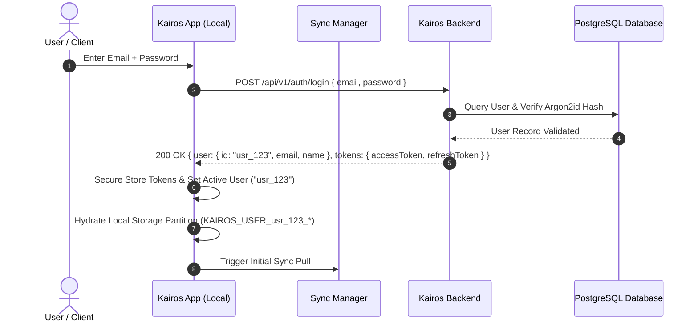
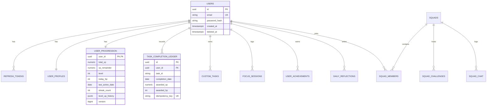
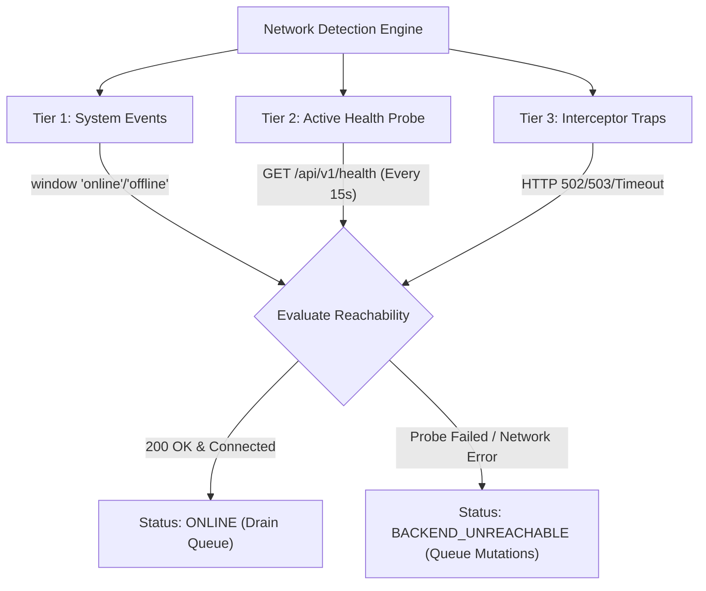

# KAIROS — PHASE E: BACKEND + OFFLINE SYNC ARCHITECTURE AUDIT

> **Document Status**: Complete Engineering Audit & Architectural Blueprint  
> **Mode**: STRICTLY READ-ONLY ARCHITECTURE AUDIT (No application source files modified)  
> **Target Milestone**: Offline-First + Backend-Synchronized Multi-User Architecture  
> **Baseline Verification**: 17 Test Suites Passing | TypeScript Compilation Passing | Production Build Passing  

---

## 1. Executive Summary

Kairos has successfully completed and verified Phases A through D:
- **Phase A**: Multi-user storage partitioning (`KAIROS_USER_<uid>_*`) and session teardown.
- **Phase B**: Data integrity, user profile isolation, companion chat memory, notification preference persistence, and morning streak boundary fixes.
- **Phase C**: Removal of fabricated leaderboard fallbacks, reactive user-switch rehydration for home and achievements, unified 5s midnight polling alignment, and toast timer unmount cleanup.
- **Phase D**: Runtime architecture review, reactive `useProgression()` subscription in `AchievementGallery.tsx` (D-01), and dev-auth fallback evaluation.

The goal of **Phase E** is to evolve Kairos from a client-side local-first prototype into an **Offline-First + Backend-Synchronized Multi-User Application**. 

### Key Audit Findings:
1. **Current Backend State**: There is currently **zero backend infrastructure** in the repository. No backend directory, package dependencies, server runtimes, database instances, or API routes exist.
2. **Current Network Decoupling**: The frontend operates 100% locally. Zero outbound `fetch()`, `axios`, or WebSocket network requests are executed. All interactions write directly to browser `localStorage` through `userScopedStorage.ts`.
3. **Core Invariants & Progression Safety**: The 100-level progression curve ($L = \min(100, \lfloor\sqrt{XP/100}\rfloor + 1)$), daily HP thresholds, fractional XP accumulator, achievement rewards (XP-only, 0 HP), and squad task contributions (0 XP, 0 HP) must be preserved without compromise. When transitioning to client-server synchronization, the server must act as an idempotent validator rather than a disruptive authority.
4. **Architectural Path**: Phase E requires establishing a modular Node.js/TypeScript backend (Express/Fastify + Prisma/PostgreSQL), an operation-based offline mutation queue in the frontend, a deterministic conflict resolution engine, and a secure tunnel architecture (Cloudflare Tunnel) to connect publicly hosted frontend clients to a local development backend.

---

## 2. Existing Backend Architecture

A thorough inspection of the repository confirms that **no backend directory or runtime currently exists**.

### Runtime Inspection Details:
- **Root Directory**: Contains frontend tooling configuration (`vite.config.ts`, `tsconfig.json`, `tailwind.config.js`, `postcss.config.js`, `capacitor.config.ts`, `package.json`).
- **Dependencies**: Frontend only (`react`, `react-dom`, `@react-three/fiber`, `@react-three/drei`, `three`, `gsap`, `@capacitor/*`). No `express`, `fastify`, `nest`, `koa`, `prisma`, `pg`, `sqlite3`, `jsonwebtoken`, or `bcrypt`.
- **Scripts**: `npm run dev` (Vite dev server), `npm run build` (`tsc && vite build`), `npm run preview` (Vite preview).
- **Existing Backend Services**: None.

### Target Backend Requirements for Phase E:
- **Runtime**: Node.js v20+ LTS (or Node.js v22) with TypeScript.
- **Framework Recommendation**: Fastify or Express with TypeScript (`tsx` / `ts-node-dev`).
- **Port Allocation**: `http://localhost:5000` (or `http://127.0.0.1:5000`) for development.
- **Startup & Dev Scripts**:
  - `npm run dev` (running in `backend/` directory with live reloading).
  - `npm run build` (transpiling TypeScript to `dist/`).
  - `npm run start` (production Node.js server execution).

---

## 3. Existing Database Architecture

### Current Status:
- **Server Database Engine**: None.
- **Client Persistence Engine**: Browser `localStorage` (or Node.js mocked `localStorage` in tests).
- **Data Partitioning**: Abstracted through `src/features/storage/userScopedStorage.ts`.
- **Primary Schema Structure**: JSON objects and arrays serialized under domain-specific string keys prefixed by `KAIROS_USER_<normalizedUserId>_`.

### Target Server Database for Phase E:
- **Recommended Engine**: **PostgreSQL 16+** (Production-grade, ACID compliant, native JSONB support, robust transaction support).
- **ORM / Query Builder**: **Prisma ORM** or **Kysely** for end-to-end TypeScript type safety and deterministic schema migrations.
- **Development Fallback**: SQLite (via `better-sqlite3` or Prisma SQLite provider) for zero-setup local execution if PostgreSQL is unavailable.

---

## 4. Existing API Inventory

### Current Inventory:
| Method | Path | Auth Required | Purpose | Request Body | Response Body |
| :--- | :--- | :--- | :--- | :--- | :--- |
| *N/A* | *None* | *N/A* | *No backend endpoints exist in the current repository* | *None* | *None* |

Total existing endpoints: **0**.

---

## 5. Frontend ↔ Backend Connection Map

An exhaustive search across `src/` for networking primitives (`fetch`, `axios`, `XMLHttpRequest`, `API_BASE_URL`, `localhost`, `127.0.0.1`, `http://`, `https://`, `ws://`, `wss://`) identified the following:

### Identified URL Patterns in Frontend:
1. **`ProfileScreen.tsx` (Lines 387, 403)**:
   - `http://localhost:3000` fallback used to construct QR code URLs when `window.location.origin` is undefined (e.g. server-side/test environments).
   - Generates: `http://localhost:3000/?profile=alex.kairos`
2. **`ConnectionsScreen.tsx` (Lines 118, 1549)**:
   - `http://localhost:3000` fallback for parsing Google Lens query parameters and incoming connection requests.
   - `https://kairos.app/connect/...` mock shareable connection link (Line 1852).
3. **Mock Peer Avatars**:
   - `https://lh3.googleusercontent.com/...` (Google public CDN assets for sample squad members).
   - `https://images.unsplash.com/...` (Unsplash stock avatars for mock connection suggestions).
4. **SVG Namespaces**:
   - `http://www.w3.org/2000/svg` (Standard XML namespace in vector icons).

### Connection Summary:
| Screen / Feature | Current Outbound Call | Target API Route | Local State Updated |
| :--- | :--- | :--- | :--- |
| `AuthScreen.tsx` | Simulated `setTimeout` (400ms) | `POST /api/v1/auth/login` | Sets active user profile in `App.tsx` & storage |
| `HomeScreen.tsx` | Local `userScopedStorage` write | `POST /api/v1/sync/batch` | Updates pinned reminders & reflections |
| `TasksScreen.tsx` | Local `progressionManager` call | `POST /api/v1/tasks/:id/complete` | Updates XP, HP, task status, streaks |
| `SquadScreen.tsx` | Local `squadService` call | `POST /api/v1/squad/contribute` | Updates squad progress & member logs |
| `CompanionScreen.tsx` | Local `userScopedStorage` write | `POST /api/v1/companion/chat` | Updates chat history array |
| `DigitalWellbeingScreen.tsx` | Local `userScopedStorage` write | `PUT /api/v1/wellbeing/limits` | Updates app focus limits & downtime |

Currently, **zero screens communicate over the network**.

---

## 6. Current Local-First Architecture & Storage Inventory

All persisted client data is managed via `src/features/storage/userScopedStorage.ts`.

### Complete Storage Domain Inventory:

| DOMAIN KEY | STORAGE CONSTANT | DATA TYPE | OWNER COMPONENT/SERVICE | READ LOCATIONS | WRITE LOCATIONS | USER SCOPED? | SHOULD SYNC? |
| :--- | :--- | :--- | :--- | :--- | :--- | :--- | :--- |
| `PROGRESSION` | `PROGRESSION_STATE_V1` | `ProgressionState` | `progressionManager.ts` | `progressionManager:loadState` | `progressionManager:persistState` | **YES** | **YES (Hybrid)** |
| `CUSTOM_TASKS` | `USER_CUSTOM_TASKS_V1` | `TaskItem[]` | `taskTimingService.ts` | `taskTimingService:loadCustomTasks` | `taskTimingService:saveCustomTasks` | **YES** | **YES (Hybrid)** |
| `TASK_TIMING` | `TASK_TIMING_SETTINGS_V1` | `TaskTimingSettings` | `taskTimingService.ts` | `taskTimingService:loadSettings` | `taskTimingService:saveSettings` | **YES** | **YES (Hybrid)** |
| `FOCUS_SESSIONS` | `FOCUS_SESSIONS_V1` | `FocusSession[]` | `focusSessionService.ts` | `focusSessionService:loadHistory` | `focusSessionService:saveHistory` | **YES** | **YES (Append-Only)** |
| `ACHIEVEMENTS` | `ACHIEVEMENTS_STATE_V6` | `Achievement[]` | `useAchievementProgress.ts` | `useAchievementProgress:load` | `useAchievementProgress:save` | **YES** | **YES (Hybrid)** |
| `SQUAD_STATE` | `SQUAD_STATE_V1` | `SquadState` | `squadService.ts` | `squadService:loadState` | `squadService:persistState` | **YES** | **YES (Server-Auth)** |
| `SQUAD_LEGACY_CHALLENGES` | `SQUAD_CHALLENGES_V1` | `Challenge[]` | `squadService.ts` | `squadService:legacyFallback` | *Read-only fallback* | **YES** | **NO (Deprecated)** |
| `NOTIFICATIONS` | `NOTIFICATIONS_V1` | `NotificationItem[]` | `NotificationScreen.tsx` | `NotificationScreen:render` | `NotificationScreen:markRead` | **YES** | **YES (Hybrid)** |
| `NOTIFICATION_PREFERENCES`| `NOTIFICATION_PREFERENCES_V1` | `NotificationPreferences` | `NotificationScreen.tsx` | `NotificationScreen:render` | `NotificationScreen:toggle` | **YES** | **YES (Hybrid)** |
| `PINNED_REMINDER` | `PINNED_REMINDER_V1` | `PinnedReminder \| null` | `HomeScreen.tsx` | `HomeScreen:loadState` | `HomeScreen:save/clear` | **YES** | **YES (Hybrid/LWW)** |
| `DAILY_REFLECTIONS` | `DAILY_REFLECTIONS_V1` | `DailyReflection[]` | `HomeScreen.tsx` | `HomeScreen:loadState` | `HomeScreen:saveReflection` | **YES** | **YES (Append-Only)** |
| `PROFILE_EXTENSION` | `USER_PROFILE_EXT_V1` | `UserProfileExtension` | `ProfileScreen.tsx` | `ProfileScreen:loadState` | `ProfileScreen:saveProfile` | **YES** | **YES (Field-Merge)** |
| `DOWNTIME_SETTINGS` | `DOWNTIME_SETTINGS_V1` | `DowntimeSettings` | `SettingsScreen.tsx` | `SettingsScreen:loadState` | `SettingsScreen:saveState` | **YES** | **YES (Hybrid)** |
| `APPS_USAGE` | `APPS_USAGE_V1` | `AppUsageItem[]` | `DigitalWellbeingScreen.tsx` | `DigitalWellbeingScreen:load` | `DigitalWellbeingScreen:save` | **YES** | **HYBRID (Aggregate)** |
| `HOURLY_TIMELINE` | `HOURLY_TIMELINE_V1` | `HourlyUsage[]` | `DigitalWellbeingScreen.tsx` | `DigitalWellbeingScreen:load` | `DigitalWellbeingScreen:save` | **YES** | **HYBRID (Aggregate)** |
| `APP_FOCUS_LIMITS` | `APP_FOCUS_LIMITS_V1` | `AppLimitItem[]` | `DigitalWellbeingScreen.tsx` | `DigitalWellbeingScreen:load` | `DigitalWellbeingScreen:save` | **YES** | **YES (Hybrid)** |
| `BREAK_INTERVALS` | `BREAK_INTERVALS_V1` | `BreakInterval[]` | `DigitalWellbeingScreen.tsx` | `DigitalWellbeingScreen:load` | `DigitalWellbeingScreen:save` | **YES** | **YES (Hybrid)** |
| `COMPANION_CHAT` | `COMPANION_CHAT_V1` | `ChatMessage[]` | `CompanionScreen.tsx` | `CompanionScreen:loadState` | `CompanionScreen:saveChat` | **YES** | **YES (Hybrid/Cap100)**|

### Session & Migration Keys:
- `KAIROS_USER_PROFILE_V1`: Global active user profile `{ email, name }` (Read/Written by `App.tsx`).
- `KAIROS_ACTIVE_USER_ID_V1`: Normalized active user string (Read/Written by `userScopedStorage.ts`).
- `KAIROS_LEGACY_MIGRATION_CLAIMED_BY_V1`: Migration lock string preventing cross-user legacy data theft.

---

## 7. Future Sync Boundary Classification

### Classification Categories:

```
┌─────────────────────────────────────────────────────────────────────────────┐
│                          KAIROS DATA ARCHITECTURE                           │
├───────────────────────────────┬─────────────────────────────┬───────────────┤
│    A. SERVER-SYNCHRONIZED     │          B. LOCAL-ONLY      │   C. HYBRID   │
│   (Authoritative Cloud Core)  │       (Device Ephemeral)    │  (Local-First)│
├───────────────────────────────┼─────────────────────────────┼───────────────┤
│ • User Auth & Credentials     │ • Navigation / Screen Stack │ • Progression │
│ • Social Graph & Connections  │ • Modal / Sheet Open States │ • Tasks       │
│ • Squad Roster & Shared Feeds │ • Active Stopwatch Ticks    │ • Focus Logs  │
│ • Global Achievement Registry │ • WebGL Buffers & Canvases  │ • Achievements│
│ • Idempotency Ledgers         │ • Form Input Buffers        │ • Reflections │
│ • Server Multi-User Broadcasts│ • Haptic / Audio Toggles    │ • Profile Ext │
│                               │ • In-Flight Pending Queue   │ • Wellbeing   │
└───────────────────────────────┴─────────────────────────────┴───────────────┘
```

### Justification:
1. **Server-Synchronized (Category A)**: Authentication sessions, shared squad challenges, and social friend connections require multi-user visibility and cannot function in client isolation.
2. **Local-Only (Category B)**: Transient UI states (active modal, current screen, Three.js animation matrices, active timer countdown ticks) should never trigger network sync.
3. **Hybrid (Category C)**: Progression, tasks, focus logs, reflections, and profile customizations MUST work instantly offline, persist locally in `userScopedStorage`, enqueue an operation, and reconcile with the server when connectivity is restored.

---

## 8. Missing Synchronization Infrastructure

To evolve Kairos into a synchronized offline-first application, the following components are currently missing:

1. **Frontend Sync Queue (`src/features/sync/syncQueue.ts`)**: Persistent FIFO queue storing offline mutations with retry backoff and idempotency keys.
2. **Synchronization Manager (`src/features/sync/syncManager.ts`)**: Background coordinator managing push/pull cycles, health monitoring, and batch dispatching.
3. **Network Status & Health Monitor (`src/features/sync/networkStatus.ts`)**: Multi-tier connectivity detection distinguishing generic internet access from Kairos backend reachability.
4. **API Client Layer (`src/api/client.ts`)**: Standardized HTTP/REST client with JWT injection, token refresh interceptors, and timeout handling.
5. **Backend Ingestion Engine (`POST /api/v1/sync/batch`)**: Atomic transaction handler validating, deduplicating, and applying mutations server-side.
6. **Idempotency & Anti-Duplication Ledger**: Database-backed ledger preventing duplicate XP/HP awards on network retry.

---

## 9. Authentication & Identity Architecture

### Current Client-Side Auth:
- `AuthScreen.tsx` simulates login via `setTimeout()` and constructs `{ email, name }`.
- Identity normalization in `userScopedStorage.ts:normalizeUserId()` maps `alex@kairos.ai` $\rightarrow$ `alex_kairos_ai`.

### Future Canonical Server Identity:
- The server will generate an immutable UUID v4 (`usr_xxxxxxxx-xxxx-xxxx-xxxx-xxxxxxxxxxxx`).
- `userScopedStorage.ts` will use the canonical Server User ID (`usr_...`) as the partition key.

### Authentication Protocol:


### Security & Token Specifications:
- **Access Token**: JWT, 15-minute expiration, contains `{ sub: userId, email, role }`. Signed with HMAC-SHA256 or RS256.
- **Refresh Token**: Opaque cryptographically secure random 256-bit token (or signed long-lived JWT), 30-day expiration, stored in DB with rotating refresh tokens (detecting replay attacks).
- **Storage**:
  - Web: HTTP-Only, Secure, SameSite=Strict cookies (or in-memory access token + HTTP-Only refresh cookie).
  - Mobile (Capacitor): Capacitor Secure Storage / Keystore / Keychain.

---

## 10. Multi-User Storage Isolation & Session Teardown

### Invariant Verification:
The application already features rigorous multi-user partitioning implemented in Phase A and verified in Phases B–D.

```
LocalStorage Structure:
├── KAIROS_ACTIVE_USER_ID_V1 -> "usr_user_a"
├── KAIROS_USER_usr_user_a_PROGRESSION_STATE_V1
├── KAIROS_USER_usr_user_a_USER_CUSTOM_TASKS_V1
├── KAIROS_USER_usr_user_a_SQUAD_STATE_V1
├── KAIROS_USER_usr_user_a_SYNC_QUEUE_V1
├── KAIROS_USER_usr_user_b_PROGRESSION_STATE_V1
└── KAIROS_USER_usr_user_b_USER_CUSTOM_TASKS_V1
```

### Account Lifecycle Guarantees:
1. **Switch User (User A $\rightarrow$ User B)**:
   - `setActiveUserId(userB.id)` updates storage partition pointer.
   - `progressionManager.switchUser(userB)` rehydrates isolated progression.
   - `squadService.switchUser(userB)` rehydrates isolated squad data.
   - `switchUserFocusSessions(userB)` & `switchUserTasks(userB)` rehydrate focus and task memory.
   - `syncManager.switchUser(userB)` flushes User A memory queue and loads User B offline sync queue.
2. **Logout**:
   - Executes session teardown: `progressionManager.resetSession()`, `squadService.resetSession()`, `resetFocusSessions()`, `resetUserTasks()`.
   - Clears tokens from secure storage.
   - Invokes `clearActiveUser()`.
   - User A persisted data remains safely partitioned and completely invisible to any subsequent user.
3. **Account Purge (Delete Account)**:
   - Client sends `DELETE /api/v1/users/me` to backend (cascading delete in PostgreSQL).
   - Client invokes `clearUserScopedData(userId)` which deletes all `KAIROS_USER_<uid>_*` keys from localStorage.
   - Executes full session reset and navigates to welcome screen.

---

## 11. Security Audit Findings

| ID | Finding | Severity | Description | Phase E Mitigation |
| :--- | :--- | :--- | :--- | :--- |
| **SEC-01** | Simulated Authentication Bypass | **HIGH** | `AuthScreen.tsx` currently allows login with arbitrary emails without password validation. | Implement Argon2id hashing, secure JWT endpoints, and server-side authentication. |
| **SEC-02** | Unvalidated Client Progression | **HIGH** | In local prototype mode, client determines all XP and level mutations. | Server must validate all task completions, XP conversions, and level bounds against server-side progression rules. |
| **SEC-03** | Lack of Rate Limiting | **MEDIUM** | No rate limiting currently exists in frontend client. | Implement Fastify/Express rate limiting (`@fastify/rate-limit`) on `/auth/*` (5 req/min) and `/sync/batch` (60 req/min). |
| **SEC-04** | CORS / Cross-Origin Exposure | **MEDIUM** | When backend is exposed to public frontend, loose CORS could permit unauthorized origins. | Strict CORS whitelist allowing only authorized production domain and local dev origin (`http://localhost:5173`). |
| **SEC-05** | Sensitive Token Storage in Web | **LOW** | Storing JWTs in plain `localStorage` exposes tokens to XSS. | Use HTTP-Only SameSite cookies on Web and native Secure Storage on Android/iOS. |
| **SEC-06** | Hardcoded Dev Origin Fallbacks | **INFORMATIONAL** | `ProfileScreen.tsx` uses `http://localhost:3000` fallback for QR codes. | Replace with configurable environment variable `VITE_PUBLIC_APP_URL`. |

---

## 12. Offline Architecture Requirements

The offline sync architecture satisfies all 10 core operational requirements:

1. **Backend Available**: User acts $\rightarrow$ Local storage updates optimistically $\rightarrow$ UI renders immediately $\rightarrow$ Sync manager uploads mutation $\rightarrow$ Server confirms $\rightarrow$ Local state marked synchronized.
2. **Backend Unavailable**: User acts $\rightarrow$ Local storage updates optimistically $\rightarrow$ UI displays "Queued / Offline" badge $\rightarrow$ Operation appended to persistent queue $\rightarrow$ App operates normally.
3. **User Performs Actions Offline**: Multiple actions (complete tasks, log focus sessions, record reflections) append sequentially to local queue with deterministic client sequence numbers.
4. **Backend Becomes Available**: Health check detects connectivity $\rightarrow$ Sync manager initiates batch upload of pending queue $\rightarrow$ UI shows "Synchronizing..." spinner.
5. **Pending Changes Synchronize**: Server processes batch atomically $\rightarrow$ Returns individual status codes (`ACK`, `ALREADY_PROCESSED`, `REJECTED`) for each operation.
6. **Concurrent Multi-Device Edits**: Server applies deterministic conflict resolution rules (see Section 14).
7. **Duplicate Synchronization Attempt**: Client retries identical operation due to dropped ACK $\rightarrow$ Server checks `idempotencyKey` $\rightarrow$ Returns cached success without duplicate XP/HP awards.
8. **Failed Synchronization**: Network error triggers exponential backoff (2s, 4s, 8s, 16s, max 60s); 4xx semantic errors move operation to dead-letter queue without blocking subsequent operations.
9. **Partial Synchronization**: Atomic batch processing ensures all-or-nothing per entity, with granular per-operation acknowledgements.
10. **Application Restart While Operations Pending**: Queue persists in `KAIROS_USER_<uid>_SYNC_QUEUE_V1`; on application boot, queue is rehydrated and automatically drained upon connectivity detection.

---

## 13. Operation Queue Design

### Data Contract (`SyncOperation`):

```typescript
export type SyncEntityType =
  | 'task'
  | 'progression'
  | 'focus'
  | 'achievement'
  | 'squad'
  | 'reflection'
  | 'reminder'
  | 'profile'
  | 'wellbeing'
  | 'preference'
  | 'companion';

export type SyncOperationType =
  | 'CREATE'
  | 'UPDATE'
  | 'DELETE'
  | 'COMPLETE'
  | 'CLAIM';

export interface SyncOperation {
  id: string;                 // UUID v4 generated at client action time (Idempotency Key)
  userId: string;             // Canonical Server User ID
  sequence: number;           // Monotonically increasing integer per user
  entityType: SyncEntityType; // Target entity domain
  entityId: string;           // Target entity identifier
  operationType: SyncOperationType;
  payload: Record<string, any>; // Operation delta or full snapshot
  clientTimestamp: number;    // UTC epoch milliseconds
  retryCount: number;         // Number of sync attempts made
  status: 'PENDING' | 'SYNCING' | 'ACKNOWLEDGED' | 'FAILED';
  lastError?: string;         // Diagnostic message if rejected
}
```

### Field Rationale & Queue Mechanics:
- **`id` (Idempotency Key)**: Uniquely identifies the client intent. If the server receives an operation ID it has already processed, it acknowledges the operation without re-executing logic.
- **`sequence`**: Guarantees FIFO execution order per user partition.
- **`clientTimestamp`**: Used by conflict resolution algorithms (Last-Write-Wins / Field-level merge).
- **`retryCount` & Backoff**: Exponential backoff with jitter (`backoffMs = min(60000, 2000 * 2^retryCount) + rand(0, 1000)`).
- **Queue Partitioning**: Stored under `KAIROS_USER_<userId>_SYNC_QUEUE_V1` ensuring complete isolation between users on the same device.

---

## 14. Conflict Resolution Design

| DOMAIN | RESOLUTION STRATEGY | CONFLICT SCENARIO | DETERMINISTIC RESOLUTION RULE |
| :--- | :--- | :--- | :--- |
| **Progression (XP / Level)** | **Monotonic Max / Server-Authoritative** | Device A gains +50 XP offline; Device B gains +100 XP offline. | Server recalculates total XP by summing verified task completion ledgers. Cumulative XP is monotonically non-decreasing. Level is derived via $L = \min(100, \lfloor\sqrt{XP/100}\rfloor + 1)$. |
| **Daily HP & Thresholds** | **Server-Authoritative Daily Ledger** | Multiple devices submit tasks on same calendar date. | Server evaluates `todayHP` against the level threshold ($100 + \lfloor L/5 \rfloor \times 15$). Tasks crossing threshold convert at $1.0\times$ pre-cap and $0.01\times$ post-cap. Server returns authoritative daily totals. |
| **Task Completion** | **Terminal True Boolean Merge** | Device A marks task complete; Device B leaves it pending. | **Completed wins**. Once marked complete on any device for a calendar date, the task remains completed. |
| **Custom Tasks** | **Field-Level Last-Write-Wins (LWW)** | Device A edits task title; Device B edits task time window. | Server merges independent fields. If the same field is modified, greatest `clientTimestamp` wins. |
| **Focus Sessions** | **Append-Only Immutable Stream** | Device A logs 25m session; Device B logs 50m session. | Both sessions are preserved as distinct historical records (keyed by `sessionId`). Total focus stats increment additively. |
| **Achievements** | **Union Set Merge** | Device A unlocks Achievement 1; Device B unlocks Achievement 2. | Both achievements are marked unlocked. XP reward is credited to user progression exactly once per achievement ID. |
| **Squad Challenges** | **Distributed Atomic Increment** | Member A and Member B contribute simultaneously. | Server executes atomic `UPDATE squad_challenges SET current = current + 1`. Both contributions are recorded in the squad contribution ledger. |
| **Profile Extension** | **Field-Level LWW** | Device A updates bio; Device B updates quote. | Server merges fields; latest timestamp wins on conflicting field keys. |
| **Reminders / Reflections**| **Date-Keyed LWW** | Device A and B submit reflection for 2026-09-23. | Latest `clientTimestamp` updates the daily reflection record. |

---

## 15. Progression Safety & Anti-Duplication Engine

### Protected Invariants:
1. **Level Formula**: $L = \min(100, \lfloor\sqrt{XP/100}\rfloor + 1)$ (Level 1 to 100, max level capped at 100).
2. **XP Conversion**: $1.0\times$ pre-threshold HP, $0.01\times$ post-threshold HP.
3. **Fractional XP**: Retained up to 2 decimal places in accumulator without truncation.
4. **Achievement Rewards**: Level-scaled XP only; **strictly 0 HP**.
5. **Squad Contributions**: Task/focus contributions advance squad goals; **strictly 0 XP and 0 HP** awarded to personal progression.
6. **Daily Rollover**: Local midnight resets `todayHP` to 0 without wiping lifetime XP or active streaks.

### Anti-Duplication Ledger Architecture:
To prevent duplication exploits (e.g. completing a task offline, duplicating requests, or reconnecting across multiple devices):

```sql
-- Server-Side Anti-Duplication Ledger Table
CREATE TABLE task_completion_ledger (
    id UUID PRIMARY KEY DEFAULT gen_random_uuid(),
    user_id UUID NOT NULL REFERENCES users(id) ON DELETE CASCADE,
    task_id VARCHAR(64) NOT NULL,
    completion_date DATE NOT NULL,
    awarded_xp NUMERIC(10, 2) NOT NULL,
    awarded_hp INTEGER NOT NULL,
    idempotency_key VARCHAR(128) UNIQUE NOT NULL,
    created_at TIMESTAMPTZ DEFAULT NOW(),
    CONSTRAINT unique_user_task_date UNIQUE (user_id, task_id, completion_date)
);
```

### Verification Flow:
1. When `/api/v1/sync/batch` or `/api/v1/tasks/:id/complete` receives a completion request:
2. Server queries `task_completion_ledger` for `(user_id, task_id, completion_date)`.
3. If record exists:
   - Request is identified as a duplicate/retry.
   - Server returns `status: "ALREADY_PROCESSED"` with the existing award details.
   - **Zero additional XP or HP is credited**.
4. If record does not exist:
   - Server inserts row into ledger inside a database transaction.
   - Authoritative progression state is updated and returned to client.

---

## 16. Proposed Minimum Required API Plan

### 1. Authentication (`/api/v1/auth`)
- `POST /api/v1/auth/register`: Register user `{ email, password, name }` $\rightarrow$ `{ user, tokens }`
- `POST /api/v1/auth/login`: Authenticate `{ email, password }` $\rightarrow$ `{ user, tokens }`
- `POST /api/v1/auth/refresh`: Refresh JWT `{ refreshToken }` $\rightarrow$ `{ accessToken, refreshToken }`
- `POST /api/v1/auth/logout`: Revoke active refresh token $\rightarrow$ `200 OK`
- `GET /api/v1/auth/me`: Current user session info $\rightarrow$ `{ user }`

### 2. User Profile (`/api/v1/profile`)
- `GET /api/v1/profile`: Retrieve user profile + extension data $\rightarrow$ `{ profile, extension }`
- `PATCH /api/v1/profile`: Update profile fields `{ name, bio, quote, handle, timezone }` $\rightarrow$ `{ profile }`

### 3. Progression (`/api/v1/progression`)
- `GET /api/v1/progression`: Authoritative progression state $\rightarrow$ `{ totalXP, level, todayHP, streakCount, ... }`
- `POST /api/v1/progression/reconcile`: Reconcile client progression state with server ledger $\rightarrow$ `{ reconciledState }`

### 4. Tasks (`/api/v1/tasks`)
- `GET /api/v1/tasks`: Get custom tasks and task timing settings $\rightarrow$ `{ customTasks, timingSettings }`
- `POST /api/v1/tasks`: Create custom task `{ title, category, targetHp, timeWindow }` $\rightarrow$ `{ task }`
- `PATCH /api/v1/tasks/:id`: Update custom task $\rightarrow$ `{ task }`
- `DELETE /api/v1/tasks/:id`: Soft-delete custom task $\rightarrow$ `200 OK`
- `POST /api/v1/tasks/:id/complete`: Record completion `{ completionDate, idempotencyKey }` $\rightarrow$ `{ completion, progressionDelta }`

### 5. Focus Sessions (`/api/v1/focus`)
- `GET /api/v1/focus/sessions`: Query historical focus sessions $\rightarrow$ `{ sessions: FocusSession[] }`
- `POST /api/v1/focus/sessions`: Create completed focus session record $\rightarrow$ `{ session }`

### 6. Achievements (`/api/v1/achievements`)
- `GET /api/v1/achievements`: User achievement unlock states $\rightarrow$ `{ achievements: Achievement[] }`
- `POST /api/v1/achievements/:id/claim`: Claim unlock reward `{ achievementId, idempotencyKey }` $\rightarrow$ `{ unlockedAchievement, awardedXP }`

### 7. Squad & Social (`/api/v1/squad`, `/api/v1/connections`)
- `GET /api/v1/squad`: Current squad state, roster, active challenges $\rightarrow$ `{ squadState }`
- `POST /api/v1/squad/contribute`: Submit challenge contribution `{ challengeId, taskId, idempotencyKey }` $\rightarrow$ `{ challengeProgress }`
- `POST /api/v1/squad/chat`: Send squad message `{ text }` $\rightarrow$ `{ chatMessage }`

### 8. Unified Sync Ingestion (`/api/v1/sync/batch`)
- `POST /api/v1/sync/batch`:
  - **Auth**: Bearer JWT Required
  - **Purpose**: Unified offline sync endpoint
  - **Request Body**:
    ```json
    {
      "lastSyncTimestamp": 1727100000000,
      "operations": [
        {
          "id": "op_98a7f-...",
          "sequence": 1,
          "entityType": "task",
          "entityId": "sys-hydration-am",
          "operationType": "COMPLETE",
          "payload": { "completionDate": "2026-09-23", "targetHp": 15 },
          "clientTimestamp": 1727101200000
        }
      ]
    }
    ```
  - **Response Body**:
    ```json
    {
      "syncTimestamp": 1727101205000,
      "results": [
        { "operationId": "op_98a7f-...", "status": "ACK", "entityId": "sys-hydration-am" }
      ],
      "deltaChanges": {
        "progression": { "totalXP": 150, "level": 2, "todayHP": 15 },
        "squad": null,
        "achievements": []
      }
    }
    ```

### 9. Health & Reachability (`/api/v1/health`)
- `GET /api/v1/health`: Lightweight probe $\rightarrow$ `{ status: "ok", timestamp: 1727101200000 }` (Used for heartbeat detection).

---

## 17. Proposed Database Schema



### Required Database Tables:
1. `users` (Account credentials, email, password hash, timestamps, soft delete).
2. `refresh_tokens` (Hashed refresh token family, expiration, device metadata).
3. `user_profiles` (Display name, bio, circadian type, handle, quote, avatar URL).
4. `user_progression` (Lifetime XP, fractional remainder, level, today HP, streak, version).
5. `task_completion_ledger` (Anti-duplication record of daily task completions and XP/HP awards).
6. `custom_tasks` (User custom tasks, category, target HP, time window, active flag, soft delete).
7. `task_timing_settings` (Circadian schedule presets, routine windows, task duration overrides).
8. `focus_sessions` (Historical focus logs, category, duration, flow score, rating).
9. `user_achievements` (Achievement unlock timestamp, claim state, awarded XP).
10. `squads` & `squad_members` (Squad metadata, member roles, joined timestamp).
11. `squad_challenges` & `squad_contributions` (Shared challenges, member progress increments).
12. `squad_chat` (Squad communication logs).
13. `daily_reflections` (Date-keyed reflections, mood, focus score, journal text).
14. `pinned_reminders` (Active pinned reminder text, color, category).
15. `sync_mutation_ledger` (Tracks every processed sync operation ID for deduplication).

---

## 18. Frontend Architecture & Service Layer Plan

```
┌────────────────────────────────────────────────────────────────────────┐
│                               UI LAYER                                 │
│      (HomeScreen, TasksScreen, SquadScreen, ProfileScreen, etc.)       │
└───────────────────────────────────┬────────────────────────────────────┘
                                    │ Subscribes & Dispatches
                                    ▼
┌────────────────────────────────────────────────────────────────────────┐
│                         SERVICE / FEATURE LAYER                        │
│   (progressionManager, taskTimingService, focusService, squadService)   │
└─────────────┬────────────────────────────────────────────┬─────────────┘
              │                                            │
              │ 1. Synchronous Optimistic Write            │ 2. Enqueue Mutation
              ▼                                            ▼
┌──────────────────────────────┐             ┌───────────────────────────┐
│     USER-SCOPED STORAGE      │             │     SYNC QUEUE MANAGER    │
│  (src/features/storage/)     │             │  (src/features/sync/)     │
│   • userScopedStorage.ts     │             │   • syncQueue.ts          │
│   • Local Partition Read/Save│             │   • syncManager.ts        │
└──────────────────────────────┘             └─────────────┬─────────────┘
                                                           │
                                                           │ 3. Drain Queue when Online
                                                           ▼
                                             ┌───────────────────────────┐
                                             │     API CLIENT LAYER      │
                                             │  (src/api/client.ts)      │
                                             │   • JWT Auth Interceptors │
                                             │   • /api/v1/sync/batch    │
                                             └─────────────┬─────────────┘
                                                           │
                                                           │ 4. HTTPS / TLS
                                                           ▼
                                             ┌───────────────────────────┐
                                             │       KAIROS BACKEND      │
                                             │  (Fastify/Express + DB)   │
                                             └───────────────────────────┘
```

### Proposed Directory Layout:
```
src/
├── api/
│   ├── client.ts              # Axios/Fetch base instance with auth interceptors
│   ├── endpoints/
│   │   ├── auth.api.ts        # Login, register, refresh, logout
│   │   ├── profile.api.ts     # Profile CRUD
│   │   ├── progression.api.ts # Progression queries & reconcile
│   │   ├── tasks.api.ts       # Task management
│   │   ├── squad.api.ts       # Squad & challenge APIs
│   │   └── sync.api.ts        # POST /api/v1/sync/batch
├── features/
│   ├── sync/
│   │   ├── syncManager.ts     # Sync coordination & polling lifecycle
│   │   ├── syncQueue.ts       # User-scoped FIFO mutation queue
│   │   ├── syncTypes.ts       # Operation contracts & sync interfaces
│   │   ├── conflictResolver.ts# Client-side delta reconciliation
│   │   └── networkStatus.ts   # Multi-tier connectivity & health check
```

---

## 19. Online / Offline Detection Design

Browser `navigator.onLine` only indicates whether a local network interface is connected, not whether the Kairos backend is reachable.

### Multi-Tier Detection Engine (`networkStatus.ts`):


### Reactive Hook (`useNetworkStatus`):
Exposes `{ isOnline: boolean, isBackendReachable: boolean, isSyncing: boolean, pendingCount: number }` to components to drive top-bar sync indicators without blocking user interactions.

---

## 20. Synchronization Lifecycle

### Full Synchronization Flow:

```
[USER ACTION (e.g. Complete Task)]
        │
        ▼
[1. Service Layer Execution]
   • Calculate XP/HP via progressionEngine
   • Write updated state to userScopedStorage (KAIROS_USER_<uid>_PROGRESSION_STATE_V1)
   • Update reactive UI immediately (Zero perceived latency)
        │
        ▼
[2. Enqueue Sync Operation]
   • Generate SyncOperation { id: UUIDv4, sequence, entityType: 'task', operationType: 'COMPLETE', payload }
   • Append to user-scoped queue: KAIROS_USER_<uid>_SYNC_QUEUE_V1
        │
        ▼
[3. Sync Engine Evaluates Network]
   ├── If OFFLINE: Retain in queue, wait for connectivity event
   └── If ONLINE: Prepare Batch Payload (up to 50 operations)
        │
        ▼
[4. Dispatch Batch to Backend]
   • POST /api/v1/sync/batch with Authorization: Bearer <JWT>
        │
        ▼
[5. Server Idempotent Processing]
   • Begin SQL Transaction
   • For each operation:
       - Check sync_mutation_ledger(operation_id)
       - If exists: Return ACK (Already Processed)
       - If new: Validate rules, update entity tables, insert task_completion_ledger row
   • Commit SQL Transaction
   • Return { results: [ACK/REJECT], deltaChanges }
        │
        ▼
[6. Client Reconciliation]
   • Mark acknowledged operations as SYNCED and remove from queue
   • Merge server delta changes into userScopedStorage
   • progressionManager / squadService emit update events
```

---

## 21. Failure Scenarios & Edge Case Matrix

| SCENARIO | IMPACT | SYSTEM RESPONSE & RECOVERY BEHAVIOR |
| :--- | :--- | :--- |
| **Backend 503 / Timeout** | Mutation cannot upload | Operation remains safely in `syncQueue`. Retried via exponential backoff (2s $\rightarrow$ 4s $\rightarrow$ 8s $\dots$ 60s). UI shows "Offline (Changes Saved Locally)". |
| **Token Expired (401)** | Request unauthorized | Sync manager pauses queue drain $\rightarrow$ invokes `POST /api/v1/auth/refresh` $\rightarrow$ on success, updates token and resumes sync; on failure, prompts re-login. |
| **Semantic Rejection (422/400)** | Server rejects payload | Operation moved to dead-letter log (`KAIROS_USER_<uid>_DEAD_LETTER_V1`) to prevent queue blockage. Diagnostic error logged. |
| **Conflict (409)** | Concurrent modification | Server returns latest authoritative entity in `deltaChanges`. Client applies domain conflict resolution rule (Section 14). |
| **Network Cut During Sync** | Batch upload interrupted | Request times out. Since every operation has a unique `idempotencyKey`, upon reconnect the client re-sends the batch; server executes unapplied mutations and ignores already-applied ones. |
| **App Killed While Pending** | Memory state cleared | On app reboot, `syncQueue` is reloaded from `userScopedStorage` (`KAIROS_USER_<uid>_SYNC_QUEUE_V1`) and queue drain triggers immediately upon network health confirmation. |
| **Logout With Pending Queue** | User switching accounts | Pending queue is stored per-user (`KAIROS_USER_<uid>_SYNC_QUEUE_V1`). User A's queue remains securely in User A's storage partition and will resume when User A logs back in. User B starts with their own isolated queue. |

---

## 22. Internet Reachability Architecture: Public Frontend to Local Backend

### The Requirement:
```
PUBLIC HOSTED FRONTEND (Vercel / Netlify / Cloudflare Pages / Mobile APK)
        │
        ▼ (Internet HTTPS)
SECURE INGRESS TUNNEL
        │
        ▼ (Encrypted Outbound Pipe)
LOCAL BACKEND RUNNING ON DEVELOPER PC (http://localhost:5000)
        │
        ▼
POSTGRESQL / SQLITE DATABASE
```

### Comparative Analysis of Reachability Approaches:

| CRITERIA | OPTION 1: CLOUDFLARE TUNNEL (`cloudflared`) [RECOMMENDED] | OPTION 2: NGROK / TAILSCALE FUNNEL | OPTION 3: ROUTER PORT FORWARDING + DDNS | OPTION 4: CLOUD VPS (Render / Fly.io / AWS) |
| :--- | :--- | :--- | :--- | :--- |
| **Security** | **HIGH**: Zero open router ports; outbound-only encrypted tunnel; Cloudflare DDoS & WAF protection. | **HIGH**: Outbound tunnel; secure token authentication. | **CRITICAL RISK**: Exposes home IP & router to port scans and public attacks. | **HIGH**: Isolated cloud VPC container. |
| **URL Stability** | **STABLE**: Custom domain (e.g. `https://api-dev.kairos.yourdomain.com`). | **UNSTABLE**: Ephemeral subdomains on free tiers. | **MODERATE**: Requires Dynamic DNS updater. | **STABLE**: Fixed cloud domain. |
| **Setup Overhead** | **LOW**: Single binary (`cloudflared tunnel run`), 5-minute setup. | **LOW**: Single CLI tool. | **HIGH**: Router firewall, NAT routing, SSL certbot renewal. | **MEDIUM**: Docker deployment, CI/CD pipeline, database hosting. |
| **Cost** | **FREE** | Free tier has bandwidth limits | Free | $5–$15/month |
| **Recommended Use** | **Development & Stage 7 Testing** | Quick Ad-hoc Testing | **NEVER RECOMMENDED** | **Production Deployment** |

### Development Setup Plan with Cloudflare Tunnel:
1. Install `cloudflared` on developer machine.
2. Authenticate tunnel with Cloudflare DNS.
3. Configure `config.yml`:
   ```yaml
   tunnel: kairos-dev-tunnel
   credentials-file: /path/to/credentials.json
   ingress:
     - hostname: api-dev.kairos.yourdomain.com
       service: http://localhost:5000
     - service: http_status:404
   ```
4. Run tunnel: `cloudflared tunnel run kairos-dev-tunnel`.
5. Configure frontend `.env.production`: `VITE_API_BASE_URL=https://api-dev.kairos.yourdomain.com`.

---

## 23. Production Deployment Architecture

When transitioning from development to full production:
1. **Frontend Hosting**: Deployed to **Cloudflare Pages** or **Vercel** with global edge CDN distribution, plus **Capacitor Mobile APK/AAB** distributed via Google Play Store / Apple App Store.
2. **Backend Hosting**: Containerized Docker container on **Railway**, **Fly.io**, **Render**, or **AWS ECS Fargate**.
3. **Database**: Managed **PostgreSQL 16** instance (Neon, Supabase, Railway, or AWS RDS) with automatic daily snapshots and connection pooling (`PgBouncer`).
4. **Environment Secrets**: Managed via cloud environment variables (`DATABASE_URL`, `JWT_SECRET`, `JWT_REFRESH_SECRET`, `CORS_ORIGIN`).
5. **Observability**: Structured JSON logging (`pino` / `winston`), health endpoints, and error tracking (Sentry).

---

## 24. Future Verification & Testing Strategy

A rigorous test suite will be created during Phase E implementation covering:

1. **Auth & Session Tests**:
   - Registration, login, token refresh, password verification.
   - Logout session teardown and token revocation.
   - Account purge cascading database deletion.
2. **Offline Queue & Reconnection Tests**:
   - Enqueue 10 task completions offline $\rightarrow$ verify local state updates $\rightarrow$ simulate reconnect $\rightarrow$ verify batch upload and single-time XP award.
3. **Multi-User Isolation & Leakage Tests**:
   - User A executes actions offline $\rightarrow$ logout $\rightarrow$ User B logs in $\rightarrow$ verify User B cannot see User A queue or data $\rightarrow$ User A logs back in $\rightarrow$ User A queue syncs correctly.
4. **Anti-Duplication Tests**:
   - Submit identical `idempotencyKey` 5 times in parallel $\rightarrow$ verify XP/HP awarded exactly once.
5. **Conflict Resolution Tests**:
   - Simulate out-of-order timestamps on profile and custom tasks $\rightarrow$ verify LWW and field-level merge correctness.
6. **Progression Formula Integrity Tests**:
   - Ensure level calculation, daily threshold splits, and 0-HP achievement rules match `KAIROS_PROGRESSION_SPEC.md` across both client and server.

---

## 25. Implementation Sequence & Impacted Files

### Recommended Step-by-Step Implementation Sequence:

```
Phase E.1: Backend Foundation & DB Schema
  ├── Initialize backend workspace (Node.js + Fastify/Express + TypeScript)
  ├── Configure Prisma / PostgreSQL schema & run initial migration
  └── Implement Argon2id password hashing & JWT auth endpoints (/api/v1/auth/*)

Phase E.2: Core Entity CRUD & Server Progression Engine
  ├── Implement server-side progression formulas matching progressionEngine.ts
  ├── Build /api/v1/tasks, /api/v1/focus, /api/v1/profile, /api/v1/achievements
  └── Build anti-duplication task completion ledger

Phase E.3: Batch Sync Ingestion Engine
  ├── Build POST /api/v1/sync/batch with atomic transaction handling
  └── Implement server idempotency ledger & delta generation

Phase E.4: Frontend Network Layer & Auth Integration
  ├── Create src/api/client.ts with JWT refresh interceptors
  ├── Create API endpoint wrappers in src/api/endpoints/*
  └── Update AuthScreen.tsx and App.tsx to use real authentication

Phase E.5: Frontend Offline Sync Manager
  ├── Implement src/features/sync/syncQueue.ts
  ├── Implement src/features/sync/syncManager.ts
  └── Implement src/features/sync/networkStatus.ts

Phase E.6: Service Layer Integration
  ├── Connect progressionManager, taskTimingService, focusService, squadService to syncQueue
  └── Update SettingsScreen.tsx to trigger account deletion API on purge

Phase E.7: Development Tunnel & Full Regression Verification
  ├── Configure Cloudflare Tunnel for secure local backend reachability
  └── Run 17 existing regression test suites + new sync test suites
```

### Explicit List of Files to Create / Modify:

#### New Backend Files to Create:
- `backend/package.json`
- `backend/tsconfig.json`
- `backend/prisma/schema.prisma`
- `backend/src/server.ts`
- `backend/src/config/env.ts`
- `backend/src/middleware/auth.middleware.ts`
- `backend/src/controllers/auth.controller.ts`
- `backend/src/controllers/sync.controller.ts`
- `backend/src/controllers/progression.controller.ts`
- `backend/src/services/progression.service.ts`
- `backend/src/services/sync.service.ts`

#### New Frontend Files to Create:
- `src/api/client.ts`
- `src/api/endpoints/auth.api.ts`
- `src/api/endpoints/progression.api.ts`
- `src/api/endpoints/tasks.api.ts`
- `src/api/endpoints/squad.api.ts`
- `src/api/endpoints/sync.api.ts`
- `src/features/sync/syncTypes.ts`
- `src/features/sync/syncQueue.ts`
- `src/features/sync/syncManager.ts`
- `src/features/sync/networkStatus.ts`
- `src/features/sync/conflictResolver.ts`

#### Existing Frontend Files to Modify (During Implementation Phase):
- `src/App.tsx` (Wire sync lifecycle, authenticated user state, network status bar indicator)
- `src/screens/AuthScreen.tsx` (Connect real login/register API to backend)
- `src/features/storage/userScopedStorage.ts` (Bind active user ID to canonical Server User ID)
- `src/features/progression/services/progressionManager.ts` (Enqueue mutations on task completion and XP updates)
- `src/features/progression/services/taskTimingService.ts` (Enqueue mutations on custom task create/edit/delete)
- `src/features/progression/services/focusSessionService.ts` (Enqueue mutations on focus session completion)
- `src/features/squad/services/squadService.ts` (Enqueue squad contributions & sync active challenges)
- `src/screens/SettingsScreen.tsx` (Call remote purge API on account deletion)
- `src/screens/ProfileScreen.tsx` (Use environment variable for public URL instead of hardcoded localhost)
- `src/screens/ConnectionsScreen.tsx` (Use environment variable for public URL instead of hardcoded localhost)

---

## 26. Architectural Risk Assessment

1. **Clock Drift Between Devices**:
   - *Risk*: Client clocks may be skewed, leading to inaccurate Last-Write-Wins evaluations.
   - *Mitigation*: The server assigns its own authoritative `server_timestamp` upon mutation receipt while logging `clientTimestamp` solely for relative ordering.
2. **XP Duplication Under Network Flakiness**:
   - *Risk*: Client retries completed tasks when ACK drops.
   - *Mitigation*: Unique database constraint on `task_completion_ledger(user_id, task_id, completion_date)` ensures zero duplicate XP awards.
3. **High Offline Queue Backlog**:
   - *Risk*: A user offline for weeks generates hundreds of operations, causing sync timeouts.
   - *Mitigation*: The sync manager batches operations in chunks of 50, processing them sequentially with progress events.
4. **Offline Token Expiration**:
   - *Risk*: Access and refresh tokens expire while user is offline for >30 days.
   - *Mitigation*: Client allows continued local operation; when connectivity returns, user is prompted to re-enter credentials to flush the pending queue.

---

## PHASE E AUDIT STATUS

- **Critical Findings**: 0
- **High Findings**: 2 (Simulated auth bypass, unvalidated client progression in current prototype mode)
- **Medium Findings**: 2 (Missing backend rate limiting, CORS configuration requirements)
- **Low Findings**: 1 (Plain localStorage JWT storage mitigation needed)
- **Informational Findings**: 1 (Hardcoded dev origin fallback in QR lens generation)

- **Application Source Files Modified**: **NO** (Strictly Read-Only Audit)
- **Database Modified**: **NO**
- **Tests Modified**: **NO**
- **Build Executed**: **YES** (17 test suites passing, TypeScript 0 errors, Vite production build passing)

---

### Recommended Implementation Sequence for Next Phase:
1. **Initialize Backend**: Set up Node.js/TypeScript backend with PostgreSQL and Prisma schema.
2. **Deploy Local Database & Auth**: Run Prisma migrations and implement JWT authentication endpoints.
3. **Build Sync Ingestion Engine**: Implement `POST /api/v1/sync/batch` with anti-duplication ledger.
4. **Implement Frontend Sync Layer**: Add `src/api/client.ts`, `syncQueue.ts`, and `syncManager.ts`.
5. **Connect Services**: Integrate `progressionManager`, `taskTimingService`, and `squadService` with the sync queue.
6. **Configure Cloudflare Tunnel**: Establish secure encrypted tunnel for public frontend to local backend testing.
7. **Execute Verification Tests**: Run comprehensive single-user, multi-user, and offline-reconnection test suites.
